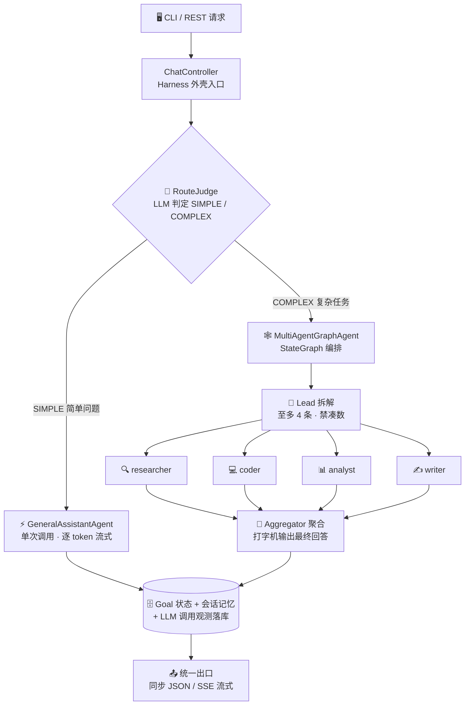
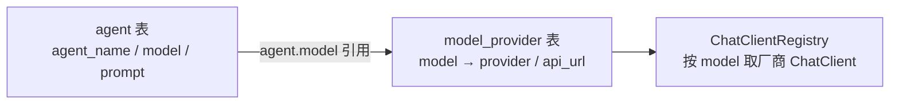

<div align="center">

[简体中文](README.md) | [English](README_EN.md)

</div>

<div align="center">


# Deerfect Harness

**基于 Spring AI 的 AI Agent 编排框架 —— 目标驱动的多 Agent 执行外壳**

[](https://openjdk.org/projects/jdk/17/)
[](https://spring.io/projects/spring-boot)
[](https://spring.io/projects/spring-ai)
[](https://github.com/alibaba/spring-ai-alibaba)
[](https://www.mysql.com/)
[](#-运行测试)
[](#-环境要求)

*简单问题直接答 · 复杂任务多 Agent 编排 · 全程流式可视化*

</div>

---

## 📑 目录

- [✨ 功能亮点](#-功能亮点)
- [🏗️ 架构总览](#%EF%B8%8F-架构总览)
- [🧰 技术栈](#-技术栈)
- [🚀 快速开始](#-快速开始)
- [🐳 Docker 部署](#-docker-部署)
- [🎮 CLI 使用](#-cli-使用)
- [🌐 REST 接口](#-rest-接口)
- [📡 SSE 流式协议](#-sse-流式协议)
- [🔁 断点续跑](#-断点续跑)
- [🤖 QQ 机器人](#-qq-机器人)
- [🔌 多模型与多服务商](#-多模型与多服务商)
- [🔌 MCP 工具接入](#-mcp-工具接入)
- [📁 项目结构](#-项目结构)
- [🧪 运行测试](#-运行测试)
- [🙏 参考与致谢](#-参考与致谢)

## ✨ 功能亮点

| | 特性 | 说明 |
|---|---|---|
| 🧠 | **智能分流** | LLM 前置判断 SIMPLE / COMPLEX：闲聊问答直接答，复杂任务才进编排，不浪费 token |
| 🕸️ | **多 Agent 编排** | StateGraph「Lead 拆解 → 专家并行 → 聚合汇总」，按难度拆解（至多 4 条、禁凑数） |
| 👨‍👩‍👧‍👦 | **专家体系** | researcher / coder / analyst / writer 四类专家，数据库驱动配置，lead 按子任务智能指派 |
| 📺 | **真·流式输出** | 逐 token SSE 推送 + 打字机效果，编排各阶段实时进度事件（编排/拆解/子任务/聚合） |
| 🧵 | **线程池治理** | 后台 Goal 走受管有界线程池（容量上限 + 队列满快速失败落 FAILED），流式派发独立池互不挤占 |
| 🛡️ | **沙箱隔离** | 模型生成的代码/命令在 Docker 容器内执行，宿主机零暴露；工具按专家最小权限分配 |
| 💾 | **会话记忆** | 多轮上下文自动组装：过滤 / token 预算截断 / 角色归一化 |
| 🧑‍🔬 | **用户偏好画像** | 跨对话长期记忆：后台定时提炼空闲会话偏好合并进全局 Markdown 画像（`user-profile/user-profile.md`），general/lead 的 system 全文注入，越聊越懂你 |
| 🔁 | **断点续跑** | graph-core 检查点落库（MySQL），长编排中断后 `/resume` 从断点继续，已完成节点不重跑 |
| 🧮 | **调用观测** | 每次 LLM 调用落库：耗时 / token / 成败，可按会话查询 |
| 📚 | **RAG 知识库** | knowledge/ 目录文档增量摄取（pgvector + DashScope 嵌入），路径 A/B 回答前检索注入，带【出处N】内联引用与来源尾注；PG 未就绪不影响启动 |
| 🖥️ | **Claude Code 风格 CLI** | spinner 原位刷新、工具调用行、回合小结，终端体验对标 Claude Code |

## 🏗️ 架构总览



> [!TIP]
> 数据流细节见 [`docs/data-flow.md`](./docs/data-flow.md)，落地 TODO 见 [`docs/HARNESS_TODO.md`](./docs/HARNESS_TODO.md)，测试全景见 [`docs/functional-testing.md`](./docs/functional-testing.md)。

## 🧰 技术栈

| 层面 | 技术 | 说明 |
|---|---|---|
| 🏛️ 框架 | Spring Boot 3.5.14 | 应用骨架、依赖注入、REST、自动配置 |
| 🤖 AI 接入 | Spring AI 1.1.4 + `spring-ai-starter-model-openai` | OpenAI 兼容协议接入多服务商（DashScope / DeepSeek），`Registry` 模式按 model 路由 |
| 🕸️ Graph 编排 | `spring-ai-alibaba-graph-core` 1.1.2.2 | StateGraph 多 Agent 编排 + 生命周期钩子进度推送 + 检查点断点续跑 |
| 📦 沙箱 | `spring-ai-alibaba-sandbox` 1.1.2.2 | 容器级工具执行隔离（agentscope-runtime）：Python/Shell/文件 + 浏览器，需本机 Docker |
| 🔌 MCP | `spring-ai-starter-mcp-client` + `server-webmvc`（SDK 锁定 0.17.0） | client 多 server 接入外部工具（懒连接 + 失败隔离）；server 以 Streamable-HTTP 暴露 `/mcp` 端点 |
| 📚 RAG | `spring-ai-pgvector-store` + PostgreSQL（pgvector）+ DashScope text-embedding-v4 | 知识库向量检索：增量摄取 + 路径 A/B 检索增强（可选依赖，PG 未就绪不影响启动） |
| 🗄️ ORM | MyBatis-Plus 3.5.7 | `goal` / `session` / `session_messages` / `agent` / `model_provider` 等 CRUD |
| 🛫 Schema | Flyway | 启动自动执行迁移脚本，无需手动建表 |
| 🖥️ CLI | 自研 `ChatCli` + OkHttp 4.12 | 独立进程纯 HTTP 客户端，SSE 解析 + 终端渲染 |
| ✅ 校验 / JSON | Jakarta Validation / Jackson | 参数校验、DTO 序列化、SSE meta 解析 |
| 🛠️ 构建 | Maven（项目内仓库 `.mvn-repo`） | 见 [快速开始](#-快速开始) |

## 🚀 快速开始

### 📋 环境要求

| 依赖 | 必需 | 说明 |
|---|---|---|
| ☕ JDK | ✅ | 17+ |
| 🛠️ Maven | ✅ | 3.8+（项目自带 settings，无需全局额外配置） |
| 🗄️ MySQL | ✅ | `harness` 库，Flyway 启动自动建表 |
| 🐳 Docker Desktop | ⚠️ 沙箱必需 | Python/Shell/浏览器工具的容器隔离；无 Docker 时仅沙箱类工具不可用，其余功能正常（需预拉取镜像，见 `docs/TECH_STACK.md`） |
| 🐘 PostgreSQL（pgvector） | 🔄 可选 | 仅 RAG 知识库使用：需启用 vector 扩展；未安装/未配置时应用照常启动，知识面为空 |
| 🔑 API Key | 🔄 可选 | DashScope（通义千问）/ DeepSeek；不配置可启动，调用模型会返回 `invalid_api_key` |

### 🗄️ 数据库准备

MySQL 只需建库一次（表结构由 Flyway 启动时自动创建，无需手动执行脚本）。连接信息在 `src/main/resources/application.yaml` 的 `spring.datasource`（默认 `localhost:3306/harness`、账号 `root`、空密码，按需修改）：

```sql
CREATE DATABASE IF NOT EXISTS harness DEFAULT CHARACTER SET utf8mb4;
```

### ⚡ 一键启动

> [!TIP]
> 三套启动脚本任选其一（**勿同时运行**，8080 端口会冲突）：
> - **`run-wsl.bat`**（Windows 推荐）：双击自动进 WSL——编译 → 后台起服务（日志在 `/tmp/javaHarness-server.log`）→ 就绪后本窗口变 CLI
> - **`run.sh`**（WSL 终端）：`./run.sh` 全流程——编译 → 新窗口起服务 → 本终端轮询就绪 → 进入 CLI；子命令 `server / stop / cli / build / test`
> - **`run-win.bat`**（Windows 本机）：Windows 侧检出 + Windows JDK/Maven 环境时使用

### 🔧 手动启动

**1️⃣ 启动主服务**

```powershell
mvn -s .mvn/settings.xml -pl shared -DskipTests install
mvn -s .mvn/settings.xml -pl server spring-boot:run
```

**2️⃣ 另开终端，启动 CLI**

```powershell
mvn -s .mvn/settings.xml -pl cli -Pcli compile exec:exec
```

**3️⃣ 或直接用 REST 聊天（无需 CLI）**

```bash
curl -s -X POST http://localhost:8080/api/chat \
  -H "Content-Type: application/json" \
  -d '{"message":"你好"}'
```

**4️⃣ （可选）配置真实 API Key**

按优先级任选其一，重启服务后即可真实对话（不配置也能启动，调用模型返回 401 占位 key 错误）：

```powershell
# 方式一：系统级环境变量（推荐，新开窗口全局生效；WSL 会话需 WSLENV 透传）
setx QWEN_API_KEY "sk-你的key"      # DashScope（通义千问）
setx DEEPSEEK_API_KEY "sk-你的key"  # DeepSeek
setx WSLENV "QWEN_API_KEY/u:DEEPSEEK_API_KEY/u"   # 透传进 WSL（Linux 侧运行时需要）

# 方式二：仓库根 .env.local（run.sh / run-wsl.bat 启动时自动加载，已被 gitignore 不入库）
#   QWEN_API_KEY=sk-你的key
#   DEEPSEEK_API_KEY=sk-你的key

# 方式三：仅当前终端会话临时生效
$env:QWEN_API_KEY = "sk-你的key"    # Windows PowerShell；WSL 用 export QWEN_API_KEY=...
```

> [!IMPORTANT]
> **首次对话前核对 agent 绑定的服务商**：种子迁移链可能把默认 agent（general/researcher）绑到
> DeepSeek 端点——只配 `QWEN_API_KEY` 时首次对话会 401。用下面 SQL 核对，若 `provider` 不是你
> 已配 key 的服务商，二选一：补配该服务商的 key，或把 agent 改绑到已配 key 的部署模型行：
>
> ```sql
> SELECT a.agent_name AS agent, p.provider, p.model, p.id AS provider_id
> FROM agent a LEFT JOIN model_provider p ON a.model_provider_id = p.id
> WHERE a.agent_name IN ('general', 'researcher');
>
> -- 改绑示例（provider_id 换成上一步查出的已配 key 的行）：
> UPDATE agent SET model_provider_id = <provider_id> WHERE agent_name = 'general';
> ```

> [!NOTE]
> 不接入 QQ 渠道？在 `application.yaml` 设 `napcat.enabled: false`（QQ 渠道为可选组件，但当前默认开启——关闭后不再有 NapCat 连接告警，其余功能不受影响）。接入与能力清单见 [🤖 QQ 机器人](#-qq-机器人)。

## 🐳 Docker 部署

不想装 JDK/Maven/数据库？`docker/` 目录提供三件套一键起：**app + MySQL 8.4（主库）+ pgvector（RAG 知识库）**，配置全部经环境变量注入，`application.yaml` 零改动，主库建表由镜像内 Flyway 自包含完成。镜像获取支持**本地构建**、**阿里云 ACR 免构建拉取**、**离线 tar 导入**三种方式。

> [!TIP]
> 完整步骤（构建 / `.env` 配置 / 知识库初始化 / ACR 拉取 / 离线部署）见 **[`docs/docker-deploy.md`](./docs/docker-deploy.md)**。

## 🎮 CLI 使用

CLI 是纯 HTTP 客户端（**不监听任何端口**），通过 REST 调用主服务：

```text
你> 你是谁
千问> 我是通义千问，一个AI助手...
```

| 命令 | 作用 |
|---|---|
| 直接输入文本 | 与当前 Agent（默认 general）聊天，多轮记忆自动延续 |
| `/new [名称]` | 🆕 新建会话并切换（旧会话保留） |
| `/agent <id>` | 🎭 切换到指定 Agent（agent 表主键，同步会话绑定）；简单问题由该 Agent 直答，复杂问题仍自动编排；`/agent` 查看当前；`/agent off` 恢复智能分流 |
| `/resume <goalId>` | 🔁 复杂编排断点续跑：从上次检查点继续（goalId 见每回合末尾会话信息） |
| `/help` / `/exit` | ❓ 帮助 / 🚪 退出 |

## 🌐 REST 接口

| 方法 | 路径 | 说明 |
|---|---|---|
| `POST` | `/api/chat` | 💬 同步聊天：`{"message":"你好","agentId":1}` |
| `POST` | `/api/chat/stream` | 📺 流式聊天（SSE）：同请求体，逐 token 推送 |
| `POST` | `/api/chat/resume?goalId=` | 🔁 复杂编排断点续跑，响应格式与 `/stream` 一致 |
| `GET` | `/api/harness/agents` | 🧩 已注册的 Agent 列表 |
| `GET` | `/api/harness/goals` | 🎯 目标（含聊天记录）与状态 |
| `GET` | `/api/harness/goals/{id}` | 🎯 查询单个目标状态 |
| `POST` | `/api/harness/submit?agent=general&objective=...` | 📤 提交一个异步目标 |
| `POST` | `/api/harness/sessions` | 🆕 新建会话（可选 `name`），返回 sessionId/name |
| `GET` | `/api/llm-calls?sessionId=&limit=` | 🧮 LLM 调用观测：耗时 / token / 成败（默认 50 条） |
| `POST` | `/api/knowledge/sync` | 📚 知识库增量摄取：扫描 knowledge/ 目录，mtime 变更文档重嵌入，并清理磁盘已删文档的孤儿向量 |
| `GET` | `/api/knowledge/documents?page=&size=` | 📚 知识库摄取台账分页 |
| `GET` | `/api/knowledge/search?q=&kb=&full=` | 📚 调试检索：检索命中片段与相关度（不注入 prompt）；`full=true` 额外返回片段原文 |
| `POST` | `/api/knowledge/upload` | 📚 multipart 上传 .md/.txt（≤1MB，可选 `kb` 表单字段归库），只落盘不摄取，重名覆盖 |
| `DELETE` | `/api/knowledge/documents/{name}` | 📚 删除指定知识文档（向量 chunk + 台账） |

> [!NOTE]
> `agentId` 可选（对应 agent 表主键）：为空走默认 Agent（general）。
> 知识库端点需 `app.knowledge.enabled=true`（默认 true）且配置好 pgvector/嵌入端点；未启用时返回 503。
> 知识库另有单文件 Web 管理页：浏览器打开 **`http://localhost:8080/knowledge.html`**（台账/删除/同步/上传/调试检索，未启用时展示降级指引）。

### 📚 知识库问答（RAG）

把文档放进 `knowledge/` 目录（`.md` / `.txt`，支持 front-matter `title:`），摄取后路径 A/B 回答自动检索注入，带【出处N】内联引用与来源尾注。触发是组装 prompt 前的旁路检查，五层条件任一不满足即静默降级、主链路零感知。

> [!TIP]
> 多知识库与 agent 绑定、目录监听 / BM25 混合检索等增强配置见 **[`docs/knowledge-rag.md`](./docs/knowledge-rag.md)**；决策流程与时序图见 [`docs/data-flow.md` 5i 节](./docs/data-flow.md#5i-rag-知识检索注入数据流prompt-组装前旁路)。

## 📡 SSE 流式协议

流式响应为 SSE 风格行协议（每个元素独占一行，`event:` + `data:` 成对）：`token` 逐 token 文本、`progress` 编排进度（不计入会话记忆）、`meta` 回合末会话信息与知识出处、`error` 流内错误，全部推完以 `[DONE]` 收尾。

> [!TIP]
> 事件流示例与字段说明见 **[`docs/sse-protocol.md`](./docs/sse-protocol.md)**；断点续跑响应格式与 `/stream` 一致。

## 🔁 断点续跑

复杂编排（COMPLEX 路径）基于 graph-core 检查点体系（`MysqlSaver` 自动建表落库，`threadId=goalId`）：

| 断开时机 | 续跑行为 |
|---|---|
| ✅ 编排已完整跑完 | 零 LLM 调用，直接回放最终回答 |
| ⏸️ 子任务批已完成、聚合中断 | 只补跑聚合（打字机输出），子任务结果复用 |
| ⏹️ 更早断开（如子任务批执行中） | 已完成节点不重跑，只补执行缺口 |
| 🚫 无任何检查点 | 快速失败：提示该 goal 未走过复杂路径 |

```bash
# API 方式
curl -N -X POST "http://localhost:8080/api/chat/resume?goalId=<goalId>"

# CLI 方式
/resume <goalId>
```

> [!NOTE]
> `goal` 不存在返回 400；仍在执行中返回 409；无检查点时流内发 `error` 事件。

## 🤖 QQ 机器人

除 CLI / REST 之外的第三个入口：基于 **OneBot 11 协议（HTTP POST 模式）** 经 [NapCat](https://napneko.github.io/) 对接 QQ 群聊与私聊。消息进入后与 REST 全链路一致（会话记忆 → SIMPLE/COMPLEX 分流 → 编排），回复按真人节奏渐进发送。

| 能力 | 说明 |
|---|---|
| 💬 群聊 @ 唤醒 | `at`（@触发）/ `prefix`（前缀）/ `all` 三种模式；私聊直答 |
| 🚦 防刷 | 同用户限频 + 私聊白名单（空 = 不限制） |
| 🎯 指定 Agent | 会话绑定后仍走统一路由判定，复杂编排失败降级回该 Agent 重答 |

> [!TIP]
> 接入步骤（NapCat 双通道配置）、渐进发送 / 表情包 / 拟人延迟等全部能力与参数见 **[`docs/qq-channel.md`](./docs/qq-channel.md)**；不接入在 `application.yaml` 设 `napcat.enabled: false`。

## 🔌 多模型与多服务商

**数据库驱动的多 Agent + 多模型服务商**，接入手性零代码：



- 🧩 **Agent**（`agent` 表）：每行一个 Agent（`agent_name`/`model`/`prompt`）。种子行：`general`/`deepseek`（聊天）、`multi-agent`（编排器）、`lead`（拆解器）、`aggregator`（聚合器）、`researcher`/`coder`/`analyst`/`writer`（专家）
- 🗺️ **模型映射**（`model_provider` 表）：新增模型/服务商 = 加一行（`status=1`）重启即生效；`status=0` 禁用 → 回退默认 DashScope 客户端
- 🧭 **路由**：请求携带 `agentId` → 映射 `agentName` 路由；未命中回退默认 `general`

> [!TIP]
> **新增第三方供应商（如 Moonshot、OpenRouter）零代码**：
> 1. 设置环境变量 `MOONSHOT_API_KEY`（约定规则：`<PROVIDER大写>_API_KEY`）
> 2. `model_provider` 表加行：`INSERT INTO model_provider(model, provider, api_url, status) VALUES('kimi-k2','moonshot','https://api.moonshot.cn/v1',1);`
> 3. 重启生效
>
> 也可在 `application.yaml` 的 `app.providers.<provider>.api-key` 显式映射（优先级高于环境变量约定），现有环境变量名保持兼容。

> [!WARNING]
> API Key 出于安全不落库，解析规则（约定优于配置）：
> 1. `app.providers.<provider>.api-key`（yaml 显式映射，优先）
> 2. `<PROVIDER大写>_API_KEY` 环境变量（约定式回退，如 `QWEN_API_KEY`、`DEEPSEEK_API_KEY`）
>
> Key 的**装载通道**：系统级环境变量（Windows 侧 + `WSLENV` 透传进 WSL）> 仓库根 `.env.local`（启动脚本自动 source，gitignored）> 当前会话 `export`；解析优先级不受通道影响。

## 🔌 MCP 工具接入

工具生态经 MCP 扩展：client 支持 stdio（本地进程）与 Streamable HTTP（远程 server），懒连接 + 按 server 失败隔离（外部 server 挂了不影响主链路）。连接配置在项目根 `mcp-config.json`（Claude/Cursor 同款 `mcpServers` 结构），**含 API Key 不入库**（已在 `.gitignore`，clone 后需自建）。

> [!TIP]
> 配置模板、按 agent 分配工具、`general` 最小权限对齐见 **[`docs/mcp-tools.md`](./docs/mcp-tools.md)**。

## 📁 项目结构

Maven 多模块工程：`shared`（领域模型与 SSE 协议）+ `server`（Spring Boot 主服务）+ `cli`（命令行客户端）+ `web`（Vue3 自包含前端）；服务端采用经典分层架构（Controller → Service → Mapper/Entity），领域模型统一收纳在 `domain` 父包下。

> [!TIP]
> 服务端完整目录树与逐文件说明见 **[`docs/project-structure.md`](./docs/project-structure.md)**。

## 🧪 运行测试

单元测试基于 JUnit 5 + Mockito，**不依赖真实数据库 / 网络 / API Key**：

```bash
mvn -s .mvn/settings.xml test
```

> [!NOTE]
> 测试全景（分组清单、功能 ↔ 测试覆盖矩阵、关键防回归点）见 [`docs/functional-testing.md`](./docs/functional-testing.md)。
> `JavaHarnessApplicationTests` 是 `@SpringBootTest`，会尝试连接本机 MySQL；无数据库环境下单独运行该类可能因连接失败报错（其余业务测试不受影响）。

## 🙏 参考与致谢

本项目的设计在以下优秀开源项目/产品的启发下完成，特此致谢：

| 参考 | 对应借鉴 |
|---|---|
| 🦌 [Deer-Flow](https://github.com/bytedance/deer-flow)（字节跳动） | 多 Agent 编排范式：「Coordinator → Planner 拆解 → 专家并行执行 → Reporter 汇总」架构与 researcher / coder / analyst / writer 专家角色划分，直接启发了本项目的 StateGraph 编排与专家 Agent 体系 |
| ⌨️ [Claude Code](https://github.com/anthropics/claude-code)（Anthropic） | CLI 终端体验：spinner 原位刷新 + 完成折叠归档、工具调用行（`⏺ 工具名(参数)` → `✓ 耗时`）、diff `+绿/-红` 着色、回合小结等交互设计（`TerminalRenderer`） |
| 🐳 [DeepSeek](https://github.com/deepseek-ai)（deepseek-ai） | Agent 工具库设计：网页抓取（fetchUrl）、文件/命令类工具的能力面划分，以及按 Agent 分配工具的最小权限思路 |

---

<div align="center">

**⭐ 如果这个项目对你有帮助，欢迎点个 Star！**

 Made with ☕ and ❤️ by Deerfect Harness contributors

</div>
