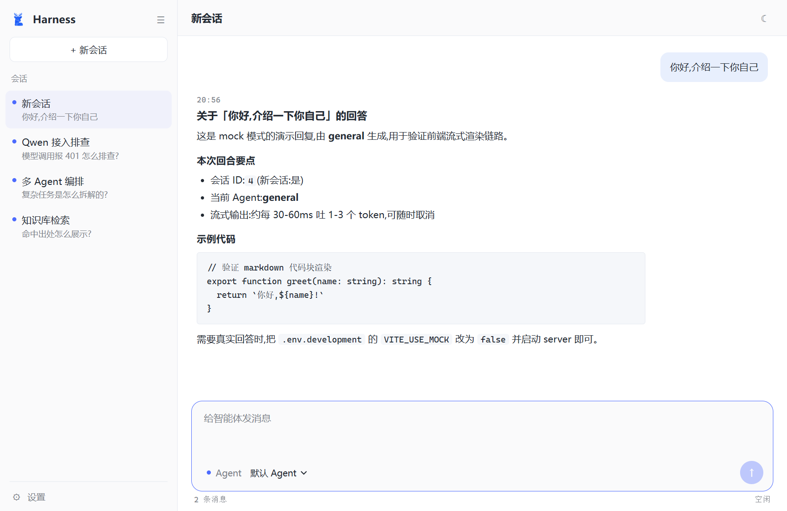
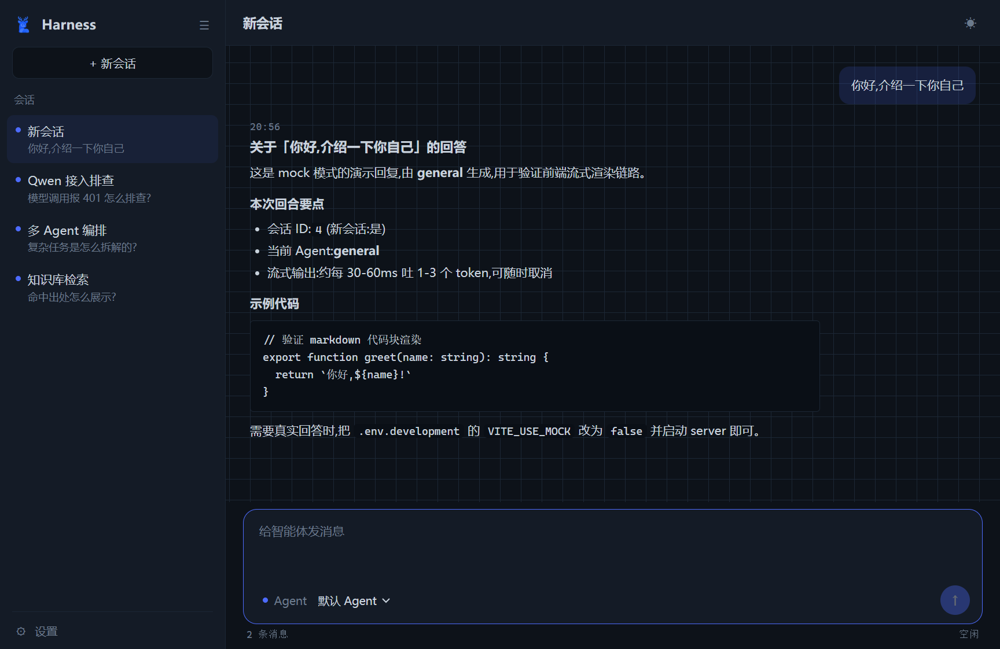

<div align="center">

[简体中文](README.md) | [English](README_EN.md)

</div>

<div align="center">


# Deerfect Harness

**让多个 AI 专家替你干活：任务发进来，自动拆解、并行执行、汇总交付。**

[](https://openjdk.org/projects/jdk/17/)
[](https://spring.io/projects/spring-boot)
[](https://spring.io/projects/spring-ai)
[](./LICENSE)
[](#-运行测试)

*简单问题直接答 · 复杂任务多 Agent 编排 · 全程流式可视化*

</div>

## 为什么需要它？

- 直接调对话 API：复杂任务要自己写循环编排、人工多轮搬运中间结果
- 通用编排框架（LangChain 等）：从零画图写代码，沙箱隔离、会话记忆、知识库还得自己拼
- 本项目把这些都做成开箱即用：**数据库里配两行就能跑**，拆解 → 专家并行 → 汇总全自动

## 核心功能

- ✅ **智能分流**：LLM 判断难度——简单问题直接答，不浪费 token；复杂任务才进编排
- ✅ **多 Agent 编排**：Lead 拆解子任务 → researcher / coder / analyst / writer 四类专家并行执行 → 聚合成稿，零编排代码
- ✅ **真·流式输出**：逐 token SSE 推送 + 编排各阶段实时进度，全程可见
- ✅ **Docker 沙箱**：模型生成的代码只在容器里跑，宿主机零暴露
- ✅ **会话记忆 + 用户画像**：多轮上下文自动组装，还有跨对话的偏好画像，越聊越懂你
- ✅ **RAG 知识库**：文档丢进 `knowledge/` 目录即生效，回答自动附出处
- ✅ **断点续跑 + 调用观测**：长编排中断后从检查点继续，已完成的不重跑；每次 LLM 调用耗时 / token / 成败落库可查
- ✅ **三种入口**：REST API（同步 / 流式）、Claude Code 风格终端 CLI、QQ 机器人

## 快速开始

**1️⃣ 准备**：JDK 17+、Maven 3.8+、MySQL 8.x，建一次库（表结构启动时自动创建）：

```sql
CREATE DATABASE IF NOT EXISTS harness DEFAULT CHARACTER SET utf8mb4;
```

**2️⃣ 打包并启动主服务**：

```bash
mvn -DskipTests package
java -jar server/target/javaHarness-server-0.0.1-SNAPSHOT.jar
```

**3️⃣ 开始对话**——另开终端进 CLI（或直接 curl）：

```bash
mvn -pl cli -Pcli compile exec:exec
```

```bash
curl -s -X POST http://localhost:8080/api/chat \
  -H "Content-Type: application/json" \
  -d '{"message":"你好"}'
```

> [!TIP]
> - 没配 API Key 也能启动（调用模型才报 401）；配 DashScope / DeepSeek 等服务商的 Key 见 **[`docs/setup.md`](./docs/setup.md)**
> - 不想装环境？Docker 三件套一键起：**[`docs/docker-deploy.md`](./docs/docker-deploy.md)**
> - 国内网络可追加 `-s .mvn/settings.xml` 走阿里云镜像（会改用项目内 `.mvn-repo/` 仓库，首次全量重新下载）

## 效果展示

**日间模式 · 会话与消息**



**夜间模式 · 流式回答（打字机 + 代码高亮）**



## 📖 文档

| 文档 | 内容 |
|---|---|
| [`docs/setup.md`](./docs/setup.md) | 本地部署详解（数据库 / API Key / 启动脚本 / agent 服务商核对） |
| [`docs/docker-deploy.md`](./docs/docker-deploy.md) | Docker 三件套部署（构建 / ACR 拉取 / 离线部署） |
| [`docs/api.md`](./docs/api.md) | REST 接口全表与知识库管理页 |
| [`docs/cli.md`](./docs/cli.md) | CLI 命令 |
| [`docs/architecture.md`](./docs/architecture.md) | 架构总览与数据流 |
| [`docs/TECH_STACK.md`](./docs/TECH_STACK.md) | 技术栈明细与扩展方向 |
| [`docs/models.md`](./docs/models.md) | 多模型与多服务商接入 |
| [`docs/knowledge-rag.md`](./docs/knowledge-rag.md) | RAG 知识库配置 |
| [`docs/sse-protocol.md`](./docs/sse-protocol.md) | SSE 流式协议 |
| [`docs/resume.md`](./docs/resume.md) | 断点续跑 |
| [`docs/qq-channel.md`](./docs/qq-channel.md) | QQ 机器人接入 |
| [`docs/mcp-tools.md`](./docs/mcp-tools.md) | MCP 工具接入 |
| [`docs/project-structure.md`](./docs/project-structure.md) | 服务端目录树 |
| [`docs/data-flow.md`](./docs/data-flow.md) | 数据流详解 |
| [`docs/functional-testing.md`](./docs/functional-testing.md) | 测试全景 |
| [`docs/HARNESS_TODO.md`](./docs/HARNESS_TODO.md) | 落地 TODO |

## 技术架构

Maven 多模块：`shared`（领域模型与 SSE 协议）+ `server`（Spring Boot 主服务）+ `cli`（终端客户端）+ `web`（Vue3 自包含前端）。核心链路：`ChatController` 入口 → `RouteJudge` 判定 SIMPLE / COMPLEX → 路径 A 单 Agent 直答 或 路径 B StateGraph 编排（Lead → 专家并行 → Aggregator）→ 统一出口。

架构图与数据流细节见 **[`docs/architecture.md`](./docs/architecture.md)** 与 **[`docs/data-flow.md`](./docs/data-flow.md)**。

## 🧪 运行测试

单元测试基于 JUnit 5 + Mockito，**不依赖真实数据库 / 网络 / API Key**：

```bash
mvn test
```

> [!NOTE]
> `JavaHarnessApplicationTests` 是 `@SpringBootTest`，会尝试连接本机 MySQL；无数据库环境下单独运行该类可能因连接失败报错（其余业务测试不受影响）。测试全景见 [`docs/functional-testing.md`](./docs/functional-testing.md)。

## 🤝 贡献

欢迎提 Issue 与 PR：问题描述请带复现步骤与日志；提交 PR 前请跑通 `mvn test`。

## 📄 许可证

[MIT](./LICENSE) © 2026 cxknotjj

## 🙏 参考与致谢

- 🦌 [Deer-Flow](https://github.com/bytedance/deer-flow)（字节跳动）— 多 Agent 编排范式与专家角色划分
- ⌨️ [Claude Code](https://github.com/anthropics/claude-code)（Anthropic）— CLI 终端交互设计
- 🐳 [DeepSeek](https://github.com/deepseek-ai) — Agent 工具库设计与最小权限思路

---

<div align="center">

**⭐ 如果这个项目对你有帮助，欢迎点个 Star！**

Made with ☕ and ❤️ by Deerfect Harness contributors

</div>
