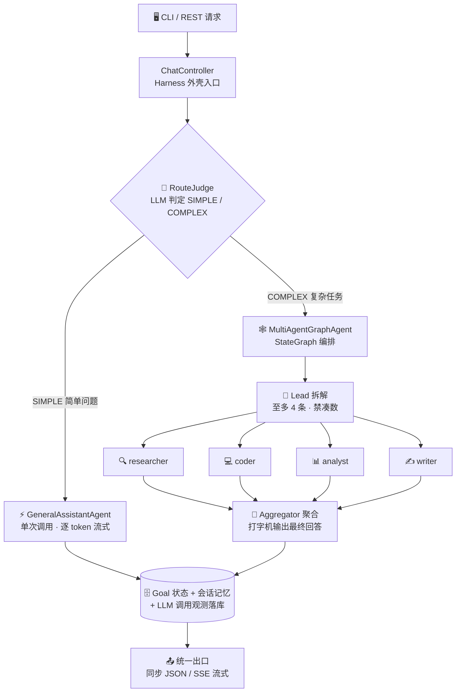
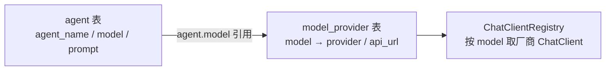

<div align="center">

[简体中文](README.md) | [English](README_EN.md)

</div>

<div align="center">

# ☕ javaHarness

**基于 Spring AI 的 AI Agent 编排框架 —— 目标驱动的多 Agent 执行外壳**

[](https://openjdk.org/projects/jdk/17/)
[](https://spring.io/projects/spring-boot)
[](https://spring.io/projects/spring-ai)
[](https://github.com/alibaba/spring-ai-alibaba)
[](https://www.mysql.com/)
[](#-运行测试)
[](#-环境要求)

*简单问题直接答 · 复杂任务多 Agent 编排 · 全程流式可视化*

</div>

---

## 📑 目录

- [✨ 功能亮点](#-功能亮点)
- [🏗️ 架构总览](#%EF%B8%8F-架构总览)
- [🧰 技术栈](#-技术栈)
- [🚀 快速开始](#-快速开始)
- [🐳 Docker 部署](#-docker-部署)
- [🎮 CLI 使用](#-cli-使用)
- [🌐 REST 接口](#-rest-接口)
- [📡 SSE 流式协议](#-sse-流式协议)
- [🔁 断点续跑](#-断点续跑)
- [🤖 QQ 机器人](#-qq-机器人)
- [🔌 多模型与多服务商](#-多模型与多服务商)
- [🔌 MCP 工具接入](#-mcp-工具接入)
- [📁 项目结构](#-项目结构)
- [🧪 运行测试](#-运行测试)
- [🙏 参考与致谢](#-参考与致谢)

## ✨ 功能亮点

| | 特性 | 说明 |
|---|---|---|
| 🧠 | **智能分流** | LLM 前置判断 SIMPLE / COMPLEX：闲聊问答直接答，复杂任务才进编排，不浪费 token |
| 🕸️ | **多 Agent 编排** | StateGraph「Lead 拆解 → 专家并行 → 聚合汇总」，按难度拆解（至多 4 条、禁凑数） |
| 👨‍👩‍👧‍👦 | **专家体系** | researcher / coder / analyst / writer 四类专家，数据库驱动配置，lead 按子任务智能指派 |
| 📺 | **真·流式输出** | 逐 token SSE 推送 + 打字机效果，编排各阶段实时进度事件（编排/拆解/子任务/聚合） |
| 🧵 | **线程池治理** | 后台 Goal 走受管有界线程池（容量上限 + 队列满快速失败落 FAILED），流式派发独立池互不挤占 |
| 🛡️ | **沙箱隔离** | 模型生成的代码/命令在 Docker 容器内执行，宿主机零暴露；工具按专家最小权限分配 |
| 💾 | **会话记忆** | 多轮上下文自动组装：过滤 / token 预算截断 / 角色归一化 |
| 🔁 | **断点续跑** | graph-core 检查点落库（MySQL），长编排中断后 `/resume` 从断点继续，已完成节点不重跑 |
| 🧮 | **调用观测** | 每次 LLM 调用落库：耗时 / token / 成败，可按会话查询 |
| 📚 | **RAG 知识库** | knowledge/ 目录文档增量摄取（pgvector + DashScope 嵌入），路径 A/B 回答前检索注入，带【出处N】内联引用与来源尾注；PG 未就绪不影响启动 |
| 🖥️ | **Claude Code 风格 CLI** | spinner 原位刷新、工具调用行、回合小结，终端体验对标 Claude Code |

## 🏗️ 架构总览



> [!TIP]
> 数据流细节见 [`docs/data-flow.md`](./docs/data-flow.md)，落地 TODO 见 [`docs/HARNESS_TODO.md`](./docs/HARNESS_TODO.md)，测试全景见 [`docs/functional-testing.md`](./docs/functional-testing.md)。

## 🧰 技术栈

| 层面 | 技术 | 说明 |
|---|---|---|
| 🏛️ 框架 | Spring Boot 3.5.14 | 应用骨架、依赖注入、REST、自动配置 |
| 🤖 AI 接入 | Spring AI 1.1.4 + `spring-ai-starter-model-openai` | OpenAI 兼容协议接入多服务商（DashScope / DeepSeek），`Registry` 模式按 model 路由 |
| 🕸️ Graph 编排 | `spring-ai-alibaba-graph-core` 1.1.2.2 | StateGraph 多 Agent 编排 + 生命周期钩子进度推送 + 检查点断点续跑 |
| 📦 沙箱 | `spring-ai-alibaba-sandbox` 1.1.2.2 | 容器级工具执行隔离（agentscope-runtime）：Python/Shell/文件 + 浏览器，需本机 Docker |
| 🔌 MCP | `spring-ai-starter-mcp-client` + `server-webmvc`（SDK 锁定 0.17.0） | client 多 server 接入外部工具（懒连接 + 失败隔离）；server 以 Streamable-HTTP 暴露 `/mcp` 端点 |
| 📚 RAG | `spring-ai-pgvector-store` + PostgreSQL（pgvector）+ DashScope text-embedding-v4 | 知识库向量检索：增量摄取 + 路径 A/B 检索增强（可选依赖，PG 未就绪不影响启动） |
| 🗄️ ORM | MyBatis-Plus 3.5.7 | `goal` / `session` / `session_messages` / `agent` / `model_provider` 等 CRUD |
| 🛫 Schema | Flyway | 启动自动执行迁移脚本，无需手动建表 |
| 🖥️ CLI | 自研 `ChatCli` + OkHttp 4.12 | 独立进程纯 HTTP 客户端，SSE 解析 + 终端渲染 |
| ✅ 校验 / JSON | Jakarta Validation / Jackson | 参数校验、DTO 序列化、SSE meta 解析 |
| 🛠️ 构建 | Maven（项目内仓库 `.mvn-repo`） | 见 [快速开始](#-快速开始) |

## 🚀 快速开始

### 📋 环境要求

| 依赖 | 必需 | 说明 |
|---|---|---|
| ☕ JDK | ✅ | 17+ |
| 🛠️ Maven | ✅ | 3.8+（项目自带 settings，无需全局额外配置） |
| 🗄️ MySQL | ✅ | `harness` 库，Flyway 启动自动建表 |
| 🐳 Docker Desktop | ⚠️ 沙箱必需 | Python/Shell/浏览器工具的容器隔离；无 Docker 时仅沙箱类工具不可用，其余功能正常（需预拉取镜像，见 `docs/TECH_STACK.md`） |
| 🐘 PostgreSQL（pgvector） | 🔄 可选 | 仅 RAG 知识库使用：需启用 vector 扩展；未安装/未配置时应用照常启动，知识面为空 |
| 🔑 API Key | 🔄 可选 | DashScope（通义千问）/ DeepSeek；不配置可启动，调用模型会返回 `invalid_api_key` |

### 🗄️ 数据库准备

MySQL 只需建库一次（表结构由 Flyway 启动时自动创建，无需手动执行脚本）。连接信息在 `src/main/resources/application.yaml` 的 `spring.datasource`（默认 `localhost:3306/harness`、账号 `root`、空密码，按需修改）：

```sql
CREATE DATABASE IF NOT EXISTS harness DEFAULT CHARACTER SET utf8mb4;
```

### ⚡ 一键启动

> [!TIP]
> 三套启动脚本任选其一（**勿同时运行**，8080 端口会冲突）：
> - **`run-wsl.bat`**（Windows 推荐）：双击自动进 WSL——编译 → 后台起服务（日志在 `/tmp/javaHarness-server.log`）→ 就绪后本窗口变 CLI
> - **`run.sh`**（WSL 终端）：`./run.sh` 全流程——编译 → 新窗口起服务 → 本终端轮询就绪 → 进入 CLI；子命令 `server / stop / cli / build / test`
> - **`run-win.bat`**（Windows 本机）：Windows 侧检出 + Windows JDK/Maven 环境时使用

### 🔧 手动启动

**1️⃣ 启动主服务**

```powershell
mvn -s .mvn/settings.xml spring-boot:run
```

**2️⃣ 另开终端，启动 CLI**

```powershell
mvn -s .mvn/settings.xml exec:java
```

**3️⃣ 或直接用 REST 聊天（无需 CLI）**

```bash
curl -s -X POST http://localhost:8080/api/chat \
  -H "Content-Type: application/json" \
  -d '{"message":"你好"}'
```

**4️⃣ （可选）配置真实 API Key**

按优先级任选其一，重启服务后即可真实对话（不配置也能启动，调用模型返回 401 占位 key 错误）：

```powershell
# 方式一：系统级环境变量（推荐，新开窗口全局生效；WSL 会话需 WSLENV 透传）
setx QWEN_API_KEY "sk-你的key"      # DashScope（通义千问）
setx DEEPSEEK_API_KEY "sk-你的key"  # DeepSeek
setx WSLENV "QWEN_API_KEY/u:DEEPSEEK_API_KEY/u"   # 透传进 WSL（Linux 侧运行时需要）

# 方式二：仓库根 .env.local（run.sh / run-wsl.bat 启动时自动加载，已被 gitignore 不入库）
#   QWEN_API_KEY=sk-你的key
#   DEEPSEEK_API_KEY=sk-你的key

# 方式三：仅当前终端会话临时生效
$env:QWEN_API_KEY = "sk-你的key"    # Windows PowerShell；WSL 用 export QWEN_API_KEY=...
```

> [!IMPORTANT]
> **首次对话前核对 agent 绑定的服务商**：种子迁移链可能把默认 agent（general/researcher）绑到
> DeepSeek 端点——只配 `QWEN_API_KEY` 时首次对话会 401。用下面 SQL 核对，若 `provider` 不是你
> 已配 key 的服务商，二选一：补配该服务商的 key，或把 agent 改绑到已配 key 的部署模型行：
>
> ```sql
> SELECT a.agent_name AS agent, p.provider, p.model, p.id AS provider_id
> FROM agent a LEFT JOIN model_provider p ON a.model_provider_id = p.id
> WHERE a.agent_name IN ('general', 'researcher');
>
> -- 改绑示例（provider_id 换成上一步查出的已配 key 的行）：
> UPDATE agent SET model_provider_id = <provider_id> WHERE agent_name = 'general';
> ```

> [!NOTE]
> 不接入 QQ 渠道？在 `application.yaml` 设 `napcat.enabled: false`（QQ 渠道为可选组件，但当前默认开启——关闭后不再有 NapCat 连接告警，其余功能不受影响）。接入与能力清单见 [🤖 QQ 机器人](#-qq-机器人)。

## 🐳 Docker 部署

不想装 JDK/Maven/数据库？`docker/` 目录提供三件套一键起：**app + MySQL 8.4（主库）+ pgvector（RAG 知识库）**，数据库连接等配置全部经环境变量注入，`application.yaml` 零改动。主库建表由应用内置 Flyway 在启动时自动完成（镜像自包含 DDL，DB 容器无需挂 init 脚本）；pgvector 扩展由 `docker/pg-init/` 在首次建库时自动启用。镜像获取有三种方式：**本地构建**（1️⃣）、**阿里云 ACR 拉取**（4️⃣，免构建推荐）、**离线 tar 导入**（5️⃣，无外网环境）。

**1️⃣ 构建镜像**

```bash
# 基础镜像可直连 Docker Hub 时：
docker build -f docker/Dockerfile -t java-harness .

# Docker Hub 不可达（国内常见）时，经加速通道覆盖基础镜像：
docker build \
  --build-arg BUILD_BASE=docker.m.daocloud.io/library/maven:3.9-eclipse-temurin-17 \
  --build-arg RUN_BASE=docker.m.daocloud.io/library/eclipse-temurin:17-jre \
  -f docker/Dockerfile -t java-harness .
```

多阶段构建：构建阶段在容器内 `mvn package`（沿用 `.mvn/settings.xml` 阿里云镜像，pom 不变时层缓存秒级重建）→ 运行阶段仅 JRE + jar + `skills/knowledge/channel` 运行期资源。

**2️⃣ 启动三件套**

```bash
# ① 启动三件套（项目根执行；首次使用先配好 docker/.env，见下方说明）
docker compose -f docker/docker-compose.yml up -d

# ② 看应用日志确认就绪：Flyway 建表 → 出现 Started JavaHarnessApplication 即成功
#    （logs 是"看日志"不是再启动一次；Ctrl+C 只是退出滚动，容器照常运行）
docker compose -f docker/docker-compose.yml logs -f app
```

**docker/.env 说明**

compose 启动时自动读取 compose 文件同目录的 `docker/.env`（`-f` 指定路径或 `cd docker` 两种方式都会读），配好后日常启动无需手动传 key。注意事项：

- **优先级**：shell 环境变量 > `docker/.env` > compose 内默认值——临时覆盖某个值时前缀即可：`QWEN_API_KEY=sk-xxx docker compose ...`
- **与 application.yaml 的关系**：jar 内 yaml 的库口令等敏感项本身就是 `${MYSQL_ROOT_PASSWORD:harness123}` 占位符写法（环境变量优先、冒号后为兜底默认值）；compose 把 `.env` 里的值同时喂给数据库容器（root 密码）和 app 容器（连接密码），两边天然一致，改口令只动 `.env` 一处（配合上条删卷注意）
- **安全**：`.env` 含 API key 与数据库口令，已在 `.gitignore` 排除，**禁止提交**；换机器部署时把它一起拷走（变量清单与逐项注释见 `docker/.env` 本体）
- **改库口令**：`MYSQL_ROOT_PASSWORD` / `PGVECTOR_PASSWORD` 修改后必须 `docker compose down -v` 删数据卷再 up，已初始化的旧卷不会自动应用新口令
- **基础镜像**：`BUILD_BASE` / `RUN_BASE` 仅 `--build` 重建镜像时生效，默认已指向 daocloud 加速通道
- **QQ 渠道**：不用 QQ 就设 `NAPCAT_ENABLED=false`；`NAPCAT_API_TOKEN` / `NAPCAT_EVENT_SECRET` 必须与 NapCat 侧配置一致，否则消息收不到/上报被拒

| 服务 | 容器名 | 说明 |
|---|---|---|
| app | `java-harness` | 8080 对外；挂载 docker.sock 沙箱可用（不需要可删该挂载） |
| mysql | `harness-mysql` | 口令 `MYSQL_ROOT_PASSWORD`（默认 `harness123`）；3306 映射仅供宿主机管理工具，不需要可删 |
| pgvector | `harness-pgvector` | 口令 `PGVECTOR_PASSWORD`（默认 `postgresql`）；宿主机 5432 被占时删映射（容器间走服务名直连） |

**compose 相对路径规则**：volumes 里的相对路径一律以 **docker-compose.yml 所在目录（`docker/`）为基准**，与在哪个目录执行命令无关（项目根 `-f docker/docker-compose.yml` 跑也一样）。因此 `../knowledge` = 项目根/knowledge（`../` 从 docker/ 上跳一级到项目根），`./config` = `docker/config`、`./pg-init` = `docker/pg-init`；容器内挂载点全部对齐 WORKDIR `/workspace`，与 jar 内相对路径配置（`app.knowledge.dir: knowledge`、`napcat.emoji.dir: channel/emojis`）正好衔接。`docker/.env` 能被自动读取也是同一条规则（compose 固定在自己的目录找 `.env`）。

常用环境变量：`DEEPSEEK_API_KEY`；QQ 渠道 `NAPCAT_API_TOKEN` / `NAPCAT_EVENT_SECRET`，不用 QQ 设 `NAPCAT_ENABLED=false`；NapCat 在远端机器时设 `NAPCAT_BASE_URL=http://<host>:3000`（默认经 host-gateway 连宿主 Docker 里的 NapCat）。

**3️⃣ 验证与知识库初始化**

```bash
curl -X POST http://localhost:8080/api/knowledge/sync   # 需真实 QWEN_API_KEY；向量数据入 pgvector
```

> [!NOTE]
> - 全新 MySQL 由 Flyway 建表 + 种子 agent；旧库存量数据（自调的 agent 行、聊天历史）迁移：`mysqldump -uroot harness --no-create-info --skip-triggers --ignore-table=harness.flyway_schema_history > seed.sql`，再 `docker exec -i harness-mysql mysql -uroot -p<口令> harness < seed.sql`
> - 知识库/技能/表情/MCP 配置已**默认外挂**（compose volumes：`../knowledge`、`../skills`、`../channel`、`../mcp-config.json`），改宿主机文件免重打镜像：`knowledge/` 改完调 sync 增量摄取（mtime 对比，免重启）；表情映射表改后 `restart app`、新增图片即时生效；`mcp-config.json` 改后 `up -d --force-recreate app`；批量调参写 `docker/config/application.yaml`（只写要改的键，改后 `restart app`，用法见该文件头注释）

**4️⃣ 从阿里云镜像仓库拉取（免构建、免传 tar）**

镜像已托管在阿里云个人版 ACR **公开仓库**（国内服务器直连快，无需登录、无需 registry-mirrors），多台部署或频繁更新时比离线 tar 省事：

```bash
REG=crpi-udfqmnkb69y8dx8r.cn-hangzhou.personal.cr.aliyuncs.com/java-harness/harness

docker pull $REG:latest
docker tag $REG:latest java-harness:latest   # 对齐 compose 的 image: java-harness（也可直接改 compose 的 image: 为仓库地址，省去 tag）
docker compose -f docker/docker-compose.yml up -d
```

> [!TIP]
> 目标机仍需 `docker/` 目录（compose + pg-init + config）与两样不进 git 的文件——`mcp-config.json` 和 `channel/emojis/` 表情图片，拷贝清单见 5️⃣。

**5️⃣ 离线部署：导出镜像到目标 Linux 服务器**

构建机与运行机不同（如构建在 Windows Docker Desktop、运行在 Linux 服务器）时，镜像包内含完整镜像层，目标机无需源码/Maven/JDK：

```bash
# 构建机：导出为单文件镜像包（Windows PowerShell / Linux 通用）
docker save java-harness -o java-harness.tar
scp java-harness.tar user@服务器IP:/opt/java-harness/
```

```bash
# 目标机：导入镜像（.tar / .tar.gz 通用，无需解压）
docker load -i java-harness.tar
# 看到 Loaded image: java-harness:latest 即成功，标签与 compose 对上，up 不触发重建
QWEN_API_KEY=sk-你的key \
docker compose -f docker/docker-compose.yml up -d
```

> [!IMPORTANT]
> - 镜像包是给 `docker load` 读取的 OCI 格式（内含 blobs/、index.json、manifest.json），**不是压缩包——别用解压软件打开它**，`load` 直接读原封的 .tar / .tar.gz；Linux 构建机可 `docker save java-harness | gzip > java-harness.tar.gz` 减小传输体积，load 同样直接读
> - **目标机必须同时拷贝 `docker/docker-compose.yml` 和 `docker/pg-init/`**——compose 把 `pg-init/` 挂载进 pgvector 容器，首次建库时预装 vector 扩展，缺了它知识库起不来；`Dockerfile`/`Dockerfile.dockerignore` 仅重建镜像时需要（整个 `docker/` 目录才几 KB，直接全拷也行）
> - mysql/pgvector 基础镜像仍在目标机现拉：国内服务器先配 `/etc/docker/daemon.json` 的 `registry-mirrors` 并重启 docker，或同样 save/load 带过去
> - compose 默认挂载的项目相对路径（`../knowledge`、`../skills`、`../channel`）目标机项目里天然就有（git 跟踪）；但两样**不进 git** 的需补传：`mcp-config.json`（不传则 up 时 Docker 自动创建同名空目录占位，MCP 读取异常——需删掉目录放真文件）与 `channel/emojis/` 表情图片（不传则表情功能静默失效）
> - 架构需一致：Docker Desktop（WSL2）产物为 `linux/amd64`，x86_64 服务器通用；ARM 服务器用不了此镜像包，需在目标机重新构建

## 🎮 CLI 使用

CLI 是纯 HTTP 客户端（**不监听任何端口**），通过 REST 调用主服务：

```text
你> 你是谁
千问> 我是通义千问，一个AI助手...
```

| 命令 | 作用 |
|---|---|
| 直接输入文本 | 与当前 Agent（默认 general）聊天，多轮记忆自动延续 |
| `/new [名称]` | 🆕 新建会话并切换（旧会话保留） |
| `/agent <id>` | 🎭 切换到指定 Agent（agent 表主键）；`/agent` 查看当前；`/agent off` 恢复智能分流 |
| `/resume <goalId>` | 🔁 复杂编排断点续跑：从上次检查点继续（goalId 见每回合末尾会话信息） |
| `/help` / `/exit` | ❓ 帮助 / 🚪 退出 |

## 🌐 REST 接口

| 方法 | 路径 | 说明 |
|---|---|---|
| `POST` | `/api/chat` | 💬 同步聊天：`{"message":"你好","agentId":1}` |
| `POST` | `/api/chat/stream` | 📺 流式聊天（SSE）：同请求体，逐 token 推送 |
| `POST` | `/api/chat/resume?goalId=` | 🔁 复杂编排断点续跑，响应格式与 `/stream` 一致 |
| `GET` | `/api/harness/agents` | 🧩 已注册的 Agent 列表 |
| `GET` | `/api/harness/goals` | 🎯 目标（含聊天记录）与状态 |
| `GET` | `/api/harness/goals/{id}` | 🎯 查询单个目标状态 |
| `POST` | `/api/harness/submit?agent=general&objective=...` | 📤 提交一个异步目标 |
| `POST` | `/api/harness/sessions` | 🆕 新建会话（可选 `name`），返回 sessionId/name |
| `GET` | `/api/llm-calls?sessionId=&limit=` | 🧮 LLM 调用观测：耗时 / token / 成败（默认 50 条） |
| `POST` | `/api/knowledge/sync` | 📚 知识库增量摄取：扫描 knowledge/ 目录，mtime 变更文档重嵌入，并清理磁盘已删文档的孤儿向量 |
| `GET` | `/api/knowledge/documents?page=&size=` | 📚 知识库摄取台账分页 |
| `GET` | `/api/knowledge/search?q=&kb=&full=` | 📚 调试检索：检索命中片段与相关度（不注入 prompt）；`full=true` 额外返回片段原文 |
| `POST` | `/api/knowledge/upload` | 📚 multipart 上传 .md/.txt（≤1MB，可选 `kb` 表单字段归库），只落盘不摄取，重名覆盖 |
| `DELETE` | `/api/knowledge/documents/{name}` | 📚 删除指定知识文档（向量 chunk + 台账） |

> [!NOTE]
> `agentId` 可选（对应 agent 表主键）：为空走默认 Agent（general）。
> 知识库端点需 `app.knowledge.enabled=true`（默认 true）且配置好 pgvector/嵌入端点；未启用时返回 503。
> 知识库另有单文件 Web 管理页：浏览器打开 **`http://localhost:8080/knowledge.html`**（台账/删除/同步/上传/调试检索，未启用时展示降级指引）。

### 📚 知识库问答（RAG）

把文档放进 `knowledge/` 目录（`.md` / `.txt`，支持 front-matter `title:`），摄取后路径 A/B 回答自动检索注入。触发是**每次组装 prompt 前的旁路检查**：总开关、角色名单、查询长度、相关度、注入预算五层条件全部满足才注入，任一不满足静默降级、主链路零感知——全部配置驱动（`application.yaml` 的 `app.knowledge.*`），决策流程与时序图见 [`docs/data-flow.md` 5i 节](./docs/data-flow.md#5i-rag-知识检索注入数据流prompt-组装前旁路)。

```bash
mkdir -p knowledge && cp 你的文档.md knowledge/
curl -X POST http://localhost:8080/api/knowledge/sync          # 增量摄取（只处理 mtime 变更的文档）
curl 'http://localhost:8080/api/knowledge/search?q=部署步骤'     # 调试检索看命中
```

回答中出现 `【出处N】` 内联引用时，CLI 回合末尾会打印「来源:」尾注；`meta.sources` / `ChatResponse.sources` 携带结构化出处（文档名/标题/相关度）。

#### 🗂️ 多知识库与 agent 绑定

`knowledge/` 的一级子目录即独立知识库（kb 标识），根目录散文档归公共库 `default`：

```bash
mkdir -p knowledge/java knowledge/frontend        # 一级子目录 = 知识库
cp spring.md knowledge/java/ && cp vue.md knowledge/frontend/
curl -X POST http://localhost:8080/api/knowledge/sync
```

在 `agent` 表 `knowledge` 列填写逗号分隔的 kb 标识（如 `java,frontend`）即可把 agent 绑定到指定知识库——检索时按向量 metadata 的 `kb` 字段过滤，agent 只读绑定的库，防止读串；列留空/NULL = 未绑定，不触发知识库检索。文档在子目录间移动（kb 变更）会在下次 sync 自动重摄取补齐。

#### ⚙️ 知识库增强配置（app.knowledge.*）

```yaml
app.knowledge:
  watch-enabled: false            # 目录监听自动摄取总开关：开启后 knowledge/ 增删改文件，
                                  # 静默期过后自动触发一次增量摄取（免手动 sync；并发安全，
                                  # 与手动 sync 同时到达时后到者跳过、由下一轮事件补齐）
  watch-debounce-seconds: 3       # 文件事件静默期（秒）：批量拷贝/编辑器原子写合并为一次
  hybrid-enabled: false           # BM25 混合检索总开关：开启后向量 + BM25 双路 RRF 融合重排，
                                  # 关键词/编号/专有名词类查询字面精确召回更好（默认关 = 纯向量）
  bm25-max-chunks: 20000          # BM25 内存索引规模护栏：chunk 总数超过则不建索引、退化为纯向量；0 = 不限
```

- **目录监听**（`watch-enabled`）：默认关。开启要求启动时 `knowledge/` 目录已存在（Docker 挂载天然保证）；监听范围 = 根目录 + 一级子目录，监听期间新建的一级子目录自动补注册；监听线程异常仅告警并自动恢复，绝不影响应用。
- **混合检索**（`hybrid-enabled`）：默认关，关闭时行为与纯向量完全一致。开启后 BM25 索引从 PG 向量表按需懒构建（`sync`/`delete` 后自动失效重建），检索输出仍受 `top-k` 约束，融合分数归一化到 (0,1] 保持「相关度 %.2f」渲染口径。
- **上传**：`POST /api/knowledge/upload`（multipart，`.md`/`.txt` ≤1MB，`kb` 可选且仅允许小写字母/数字/-/_）只落盘不自动摄取——随后调 sync 或依赖目录监听生效；管理页上传成功会自动链同步。

## 📡 SSE 流式协议

响应 `Content-Type: text/plain`（SSE 风格行协议，每个 Flux 元素独占一行，`event:` + `data:` 成对），事件流示例：

```text
event: progress
data: {"stage":"编排","detail":"开始拆解复杂目标…"}
event: progress
data: {"stage":"拆解","detail":"4 个子任务已就绪"}
event: token
data: 片段1
event: token
data: 片段2
...
data: [DONE]
event: meta
data: {"sessionId":"9","newSession":true,"goalId":null,"status":"SUCCEEDED","error":null}
```

| 事件 | 含义 |
|---|---|
| 📺 `event: token` | 模型生成的文本片段（逐 token 推送；行内换行已转义保证单行完整） |
| 📣 `event: progress` | 编排各阶段实时进度（编排/拆解/子任务完成/聚合），**不计入会话记忆** |
| 🏷️ `event: meta` | 回合末尾的会话信息：`sessionId` / `newSession` / `goalId` / `status`；失败时 `status=FAILED` 且追加 `error`；知识命中时携带 `sources`（文档名/标题/相关度） |
| ⚠️ `event: error` | 流内错误信息 |

> [!IMPORTANT]
> - 每个 SSE 事件以单个元素成对输出（`event:`+`data:` 不会被其它事件交叉打断）
> - 全部推完发送 `[DONE]`
> - 可用 `curl -N` 观察逐段到达

## 🔁 断点续跑

复杂编排（COMPLEX 路径）基于 graph-core 检查点体系（`MysqlSaver` 自动建表落库，`threadId=goalId`）：

| 断开时机 | 续跑行为 |
|---|---|
| ✅ 编排已完整跑完 | 零 LLM 调用，直接回放最终回答 |
| ⏸️ 子任务批已完成、聚合中断 | 只补跑聚合（打字机输出），子任务结果复用 |
| ⏹️ 更早断开（如子任务批执行中） | 已完成节点不重跑，只补执行缺口 |
| 🚫 无任何检查点 | 快速失败：提示该 goal 未走过复杂路径 |

```bash
# API 方式
curl -N -X POST "http://localhost:8080/api/chat/resume?goalId=<goalId>"

# CLI 方式
/resume <goalId>
```

> [!NOTE]
> `goal` 不存在返回 400；仍在执行中返回 409；无检查点时流内发 `error` 事件。

## 🤖 QQ 机器人

除 CLI / REST 之外的第三个入口：基于 **OneBot 11 协议（HTTP POST 模式）** 经 [NapCat](https://napneko.github.io/) 对接 QQ 群聊与私聊。消息进入后与 REST 全链路一致（会话记忆 → SIMPLE/COMPLEX 分流 → 编排），回复按真人节奏分段发出。

| 能力 | 说明 |
|---|---|
| 💬 群聊 @ 唤醒 | `group-trigger.mode`: `at`（@机器人触发）/ `prefix`（命令前缀）/ `all`；私聊直答 |
| 📝 渐进发送 | 回复按 ≤`split-chars` 字切片（段落 → 换行 → 。！？句读 → 整块），像真人连发；超 `max-chunks` 条合并为最后一条 |
| ⏱️ 动态拟人延迟 | 条间停顿 = 基础延迟 + 字数 × `delay-factor`（0.1s/字）± 随机扰动，`max-delay-ms` 截断；首条秒回 |
| 😀 表情包 | 回复每条切片后按情绪关键词/句尾符号（~！!）命中自动甩表情（映射表 `channel/emoji-index.json`，图片 `base64://` 内联、跨机部署可用），`probability` / `max-per-reply` 控频 |
| 🧵 会话记忆 | 同一 QQ 用户自动延续多轮上下文；`@机器人 /reset`（群聊）或 `/reset`（私聊）重置会话 |
| 🚦 防刷 | 同用户限频（`rate-limit.per-user-seconds`）+ 私聊白名单（`private-allow-users`，空 = 不限制） |
| ␥ 聊天超时 | `chat-timeout-seconds` 超时放弃回复（后台跑完仍落会话记忆），防 LLM 卡死占满线程池 |
| 🎯 指定 Agent | `agent-id` 填 agent 表主键后 QQ 渠道直连该 Agent（其 knowledge 绑定自动生效，跳过路由判定） |

**接入步骤**（NapCat 侧建议 Docker 部署，只允许 HTTP POST、不用 WebSocket）：

1. NapCat 配置 `onebot11` 网络双通道——正向 API + 反向上报：

   ```jsonc
   {
     "httpServers": [{ "name": "java-harness", "host": "0.0.0.0", "port": 3000,
                        "enableCors": false, "enableWebsocket": false,
                        "messagePostFormat": "array", "token": "<与 napcat.api-token 一致>" }],
     "httpClients": [{ "name": "report-to-harness", "url": "http://<harness主机>:8080/onebot/event",
                        "messagePostFormat": "array", "reportSelfMessage": false,
                        "token": "<与 napcat.event-secret 一致>" }]
   }
   ```

2. harness 侧 `application.yaml` 的 `napcat:` 块按注释配置（`enabled` / `api-base-url` / `api-token` / `self-id` 等，全部有默认值）；不接入设 `napcat.enabled: false` 即可
3. 表情包（可选）：图片放 `channel/emojis/`（不进 git，自行放置），在 `channel/emoji-index.json` 登记表情名 → 文件与情绪 tags

> [!NOTE]
> 跨机部署（NapCat 在远端 Docker、harness 在本机）时 NapCat 侧 `api-base-url` 用 `ssh -L 3000:127.0.0.1:3000` 隧道转发；上报方向反向走 `httpClients` 直推 harness 的 8080。

## 🔌 多模型与多服务商

**数据库驱动的多 Agent + 多模型服务商**，接入手性零代码：



- 🧩 **Agent**（`agent` 表）：每行一个 Agent（`agent_name`/`model`/`prompt`）。种子行：`general`/`deepseek`（聊天）、`multi-agent`（编排器）、`lead`（拆解器）、`aggregator`（聚合器）、`researcher`/`coder`/`analyst`/`writer`（专家）
- 🗺️ **模型映射**（`model_provider` 表）：新增模型/服务商 = 加一行（`status=1`）重启即生效；`status=0` 禁用 → 回退默认 DashScope 客户端
- 🧭 **路由**：请求携带 `agentId` → 映射 `agentName` 路由；未命中回退默认 `general`

> [!TIP]
> **新增第三方供应商（如 Moonshot、OpenRouter）零代码**：
> 1. 设置环境变量 `MOONSHOT_API_KEY`（约定规则：`<PROVIDER大写>_API_KEY`）
> 2. `model_provider` 表加行：`INSERT INTO model_provider(model, provider, api_url, status) VALUES('kimi-k2','moonshot','https://api.moonshot.cn/v1',1);`
> 3. 重启生效
>
> 也可在 `application.yaml` 的 `app.providers.<provider>.api-key` 显式映射（优先级高于环境变量约定），现有环境变量名保持兼容。

> [!WARNING]
> API Key 出于安全不落库，解析规则（约定优于配置）：
> 1. `app.providers.<provider>.api-key`（yaml 显式映射，优先）
> 2. `<PROVIDER大写>_API_KEY` 环境变量（约定式回退，如 `QWEN_API_KEY`、`DEEPSEEK_API_KEY`）
>
> Key 的**装载通道**：系统级环境变量（Windows 侧 + `WSLENV` 透传进 WSL）> 仓库根 `.env.local`（启动脚本自动 source，gitignored）> 当前会话 `export`；解析优先级不受通道影响。

## 🔌 MCP 工具接入

工具生态经 MCP 扩展：client 支持 stdio（本地进程）与 Streamable HTTP（远程 server），懒连接 + 按 server 失败隔离（外部 server 挂了不影响主链路），连接事件落库 `mcp_server_log`。

连接配置在项目根 `mcp-config.json`（Claude/Cursor 同款 `mcpServers` 结构）。**该文件含 API Key，属本地配置不入库**（已在 `.gitignore`，clone 后需自建），模板：

```json
{
  "mcpServers": {
    "tavily": { "url": "https://mcp.tavily.com/mcp/?tavilyApiKey=<你的Tavily key>" }
  }
}
```

- 远程 server 填 `url`，本地进程填 `command`(±`args`)；`enabled: false` 跳过条目；**改配置需重启**
- **按 agent 分配**：`agent` 表 `tools` 列按精确工具名授予（改库免重启）。如把 Tavily 搜索分给 general/researcher：

```sql
UPDATE agent SET tools = CONCAT(tools, ', tavily_search')
WHERE agent_name IN ('general', 'researcher') AND tools NOT LIKE '%tavily_search%';
```

- 未声明的工具模型不可见；声明时 server 未连接则该 token 跳过（warn），不影响其余工具

> [!IMPORTANT]
> **最小权限**：`general` 是所有回退路径的落点（路由兜底/未识别专家/lead 漏指派），已收敛为只读探索者
> （网页抓取 + 沙箱只读文件 + 浏览器 + MCP 白名单）——执行类 `sandbox.base` 与写入类 `sandbox.write`
> 只留给 lead 明确指派的 `coder`/`analyst`。general 的 `tools` 列对齐已由 V17 迁移自动落库（新库/存量库跑 Flyway 即生效），仅 Flyway 管不到的外部库需手工对齐
> （数据驱动优先于代码内置，改库即生效）：

```sql
UPDATE agent SET tools = 'web, sandbox.read, sandbox.browser, tavily_search'
WHERE agent_name = 'general' AND (tools LIKE '%sandbox.base%' OR tools LIKE '%sandbox.write%');
```

> [!NOTE]
> MCP 工具返回内容不经过项目的内容裁剪链（缓存/相关段落过滤），超长由工具结果硬预算统一截断。

## 📁 项目结构

采用经典分层架构（Controller → Service → Mapper/Entity），领域模型统一收纳在 `domain` 父包下：

<details>
<summary><b>📂 点击展开完整目录树</b></summary>

```text
src/main/java/com/dark/javaHarness/
├── JavaHarnessApplication.java   # Spring Boot 启动类（@MapperScan 指向 mapper 包）
├── controller/                   # 表现层：REST 接口 + SSE 流式
│   ├── ChatController.java       # 聊天接口（/api/chat、/stream、/resume、/goal-status）
│   ├── HarnessController.java    # 管理接口（agents / submit / goals / sessions / 会话绑定 Agent）
│   ├── ProviderAdminController.java  # 模型映射管理（/api/providers 查看与热刷新新增）
│   └── LlmCallController.java    # LLM 调用观测查询（/api/llm-calls）
├── service/                      # 业务层（接口 + impl/ 实现）
│   ├── AgentService / GoalService / SessionService / ChatService  # 编排、目标、会话记忆、聊天用例
│   ├── RouteJudge.java           # 主 Agent 路由判断（SIMPLE / COMPLEX 分流）
│   ├── AgentConfigProvider.java  # 从 agent 表读取运行配置（路由映射）
│   ├── ProviderAdminService.java # model_provider 映射管理（新增即热刷新注册表）
│   └── impl/                     # AgentServiceImpl / ChatServiceImpl / LlmRouteJudge / LlmCallRecorder 等
├── advisor/                      # Spring AI Advisor 拦截器（Agent 流程横切管理）
│   ├── ContextAssemblingAdvisor.java  # 上下文组装：过滤/token 预算截断/role 归一化
│   └── PromptBudgetAdvisor.java  # Prompt 分段预算（历史/user/工具结果三段裁剪）
├── config/                       # 应用配置
│   ├── GoalExecutorConfig.java   # 执行线程池：goal-exec- 后台 Goal 池 + mvc-async- MVC 异步槽位
│   ├── ContextBudgetProperties.java  # 上下文预算统一配置（app.context.*，yaml 为唯一数值源）
│   ├── KnowledgeProperties.java  # RAG 知识库配置载体（app.knowledge.*）
│   ├── KnowledgeConfig.java      # 知识库装配：向量库数据源/嵌入模型/PgVectorStore（条件装配+懒连接）
│   ├── PrimaryDataSourceConfig.java  # 主库（MySQL）显式声明（@Primary，多数据源下 Flyway/MyBatis 归属）
│   ├── MybatisPlusConfig.java    # MyBatis-Plus 分页等配置
│   └── agent/                    # Agent 配置与装配
│       ├── ChatAgentConfig.java  # 注册各 Agent bean + graph-core 检查点存储器（MysqlSaver）
│       ├── ChatClientFactory.java    # 按服务商构建 OpenAI 兼容 ChatClient（Registry 模式）
│       ├── ChatClientRegistry.java   # 模型名 → ChatClient 注册表（支持热刷新）
│       └── ThinkingSwitchChatModel.java  # 按 model_provider.disable_thinking 注入思考开关
├── prompt/                       # Prompt 组装管线（两路径统一）
│   ├── PromptAssembler.java      # 五段式 system prompt 组装（角色/工具索引/纪律/输出约定/skill）
│   ├── MemoryPolicy.java         # 会话记忆按角色注入矩阵
│   ├── SkillManager.java / SkillRepository.java  # Markdown 技能库动态装配（按需注入 system）
│   ├── ToolLazyManager.java      # 工具 Schema 两段式延迟加载（轻量索引 → expand_tool 展开）
│   └── PromptSection.java / SkillSectionProvider.java  # 段模型与 skill 扩展点
├── mapper/                       # 数据访问层：MyBatis-Plus Mapper
│   └── AgentMapper / GoalMapper / SessionMapper / SessionMessageMapper / ModelProviderMapper / LlmCallLogMapper
├── domain/                       # 领域模型（父包）
│   ├── Goal.java                 # 目标 + 状态（PENDING/RUNNING/SUCCEEDED/FAILED）
│   ├── AgentConfig.java          # Agent 运行配置（model + prompt），来自 agent 表
│   ├── RouteDecision.java        # 路由决策枚举（SIMPLE / COMPLEX）
│   ├── LlmCallLog.java           # 一次 LLM 调用的观测记录（耗时/token/成败）
│   ├── dto/                      # 传输对象（ChatRequest/ChatResponse/SseMeta/分页等）
│   └── entity/                   # 数据库实体（对应 agent / goal / session / model_provider / llm_call_log 表）
├── enums/                        # 枚举与共享常量：GoalStatus、AgentConstants、SseProtocol
├── exception/                    # 全局异常处理（@RestControllerAdvice，统一 {code, message}）
├── agent/                        # Agent 抽象、编排与 LLM 调用
│   ├── Agent.java / AgentRegistry.java    # Agent 接口与注册表
│   ├── GeneralAssistantAgent.java  # 路径 A：单模型对话（真·逐 token stream）
│   ├── MultiAgentGraphAgent.java   # 路径 B：StateGraph 编排门面（lead→并行子任务→聚合 + 断点续跑）
│   ├── AgentChatCaller.java        # LLM 调用封装（工具循环、幻觉工具容错、BudgetLedger 熔断记账）
│   ├── AgentRequestSpecFactory.java  # 两路径共用请求组装工厂（system/记忆注入/工具装饰/输出档位）
│   ├── LeadOutputParser.java       # lead 拆解 JSON 解析（子任务数 + 专家指派白名单）
│   ├── OrchestrationBudget.java    # 编排预算账本（AtomicLong 共享记账 + 降级说明）
│   ├── MultiAgentStreamPipeline.java  # 编排流式管道（进度行 → SSE 事件装配、续跑检查点选择）
│   ├── BranchProgressListener.java # graph-core 生命周期钩子旁路（并行分支完成事件串行发射）
│   ├── LlmRetry.java               # LLM 调用重试策略
│   └── ProgressLine.java           # 进度行线协议（MARK+stage+SEP+detail）编解码
├── knowledge/                    # RAG 知识库
│   ├── KnowledgeDocumentScanner.java  # 知识目录扫描（.md/.txt、front-matter 标题、坏文件跳过）
│   ├── MarkdownChunker.java      # 段落感知切分（~700 字符 + 重叠，纯函数）
│   ├── KnowledgeService(Impl).java  # 增量摄取（mtime 比对删旧写新）/ 删除 / 分页 / 检索
│   └── KnowledgeRetriever.java   # 检索注入器：user 文本→top-k 命中→【出处N】知识段（预算截断）
├── cli/                          # 命令行客户端（独立进程，纯 HTTP 连 8080）
│   ├── ChatCli.java              # 门面：main / chatLoop / 命令分发 / 回合执行
│   ├── ResumeStateStore.java     # /resume 续跑目标持久化（状态文件读写 + 宽容解析）
│   ├── input/TerminalInput.java  # 终端输入层：JLine 历史/补全/粘贴；无 TTY 降级行式读取
│   ├── api/ChatApiClient.java    # OkHttp 封装聊天/流式/续跑/供应商/会话接口（SSE 解析）
│   └── render/                   # Claude Code 风格渲染
│       ├── TerminalRenderer.java # 门面：流式增量直出 + spinner 折叠协作 + 工具调用行
│       ├── MarkdownAnsiRenderer.java / Ansi.java  # Markdown 行级 ANSI 着色
│       └── Spinner.java          # 阶段进度 spinner（原位刷新）
└── tool/                         # 工具层
    ├── WebTools.java             # 网页抓取门面（fetchUrl：抓取 + 30min 内容缓存 + 相关段落裁剪）
    ├── HtmlToMarkdown.java / ContentRelevance.java  # 噪声剔除/主内容 Markdown 化 / 按查询意图裁剪
    ├── SandboxToolProvider.java  # 容器级沙箱工具（Python/Shell/文件 + 浏览器，懒初始化、失败降级）
    ├── McpToolProvider.java / McpConfigParser.java  # MCP 工具接入（多 server 懒连接、失败隔离）/ mcp-config.json 解析
    ├── McpServerTools.java       # 内置 MCP Server 暴露的演示工具（Streamable-HTTP /mcp）
    ├── ToolAssignments.java      # 工具分配表：按专家分配工具集（双通道注入，最小权限）
    ├── ToolCallBudget.java / ToolCallTracer.java    # 工具次数/结果硬预算 / 调用起止进度行（装饰内核）
    ├── ToolCallbackDecorator.java / ToolDecorationContext.java  # 可插拔装饰器接口与上下文（Ordered 责任链）
    ├── ToolObservationDecorator.java / ToolBudgetDecorator.java / ToolLazyLoadDecorator.java / SkillMetaToolDecorator.java  # 默认装饰链四组件（观测100→预算200→懒加载300→元工具400）
    ├── DefaultToolDecorators.java  # 默认装饰链工厂（单一事实来源；新增装饰器=新类+此处登记一行）
    └── TokenEstimator.java       # 全项目统一 token 估算口径
```

</details>

> [!NOTE]
> **分层职责**：`controller` 收发 REST/SSE，不承载业务逻辑；`service` 编排核心逻辑（接口与实现分离）；`mapper` / `domain.entity` 负责数据库读写与映射。

## 🧪 运行测试

单元测试基于 JUnit 5 + Mockito，**不依赖真实数据库 / 网络 / API Key**：

```bash
mvn -s .mvn/settings.xml test
```

> [!NOTE]
> 测试全景（分组清单、功能 ↔ 测试覆盖矩阵、关键防回归点）见 [`docs/functional-testing.md`](./docs/functional-testing.md)。
> `JavaHarnessApplicationTests` 是 `@SpringBootTest`，会尝试连接本机 MySQL；无数据库环境下单独运行该类可能因连接失败报错（其余业务测试不受影响）。

## 🙏 参考与致谢

本项目的设计在以下优秀开源项目/产品的启发下完成，特此致谢：

| 参考 | 对应借鉴 |
|---|---|
| 🦌 [Deer-Flow](https://github.com/bytedance/deer-flow)（字节跳动） | 多 Agent 编排范式：「Coordinator → Planner 拆解 → 专家并行执行 → Reporter 汇总」架构与 researcher / coder / analyst / writer 专家角色划分，直接启发了本项目的 StateGraph 编排与专家 Agent 体系 |
| ⌨️ [Claude Code](https://github.com/anthropics/claude-code)（Anthropic） | CLI 终端体验：spinner 原位刷新 + 完成折叠归档、工具调用行（`⏺ 工具名(参数)` → `✓ 耗时`）、diff `+绿/-红` 着色、回合小结等交互设计（`TerminalRenderer`） |
| 🐳 [DeepSeek](https://github.com/deepseek-ai)（deepseek-ai） | Agent 工具库设计：网页抓取（fetchUrl）、文件/命令类工具的能力面划分，以及按 Agent 分配工具的最小权限思路 |

---

<div align="center">

**⭐ 如果这个项目对你有帮助，欢迎点个 Star！**

 Made with ☕ and ❤️ by javaHarness contributors

</div>
