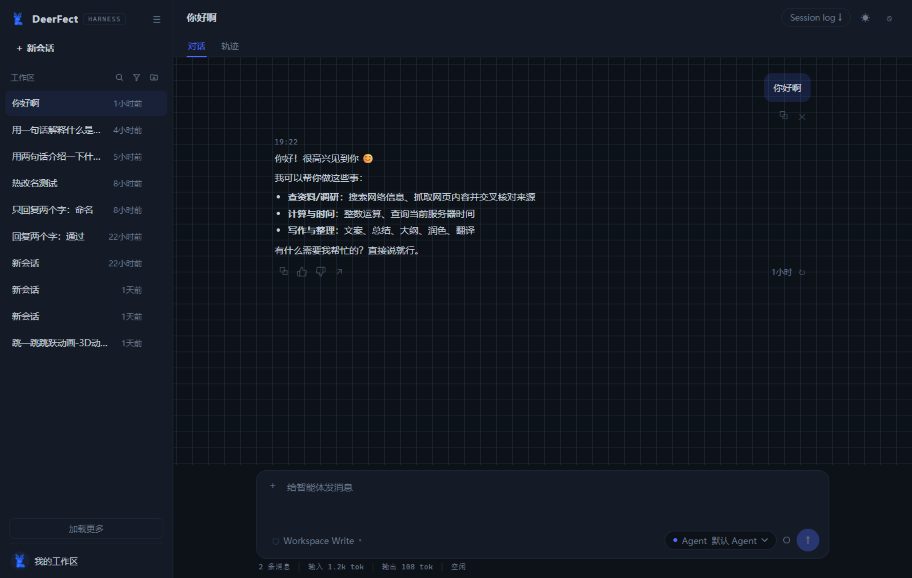
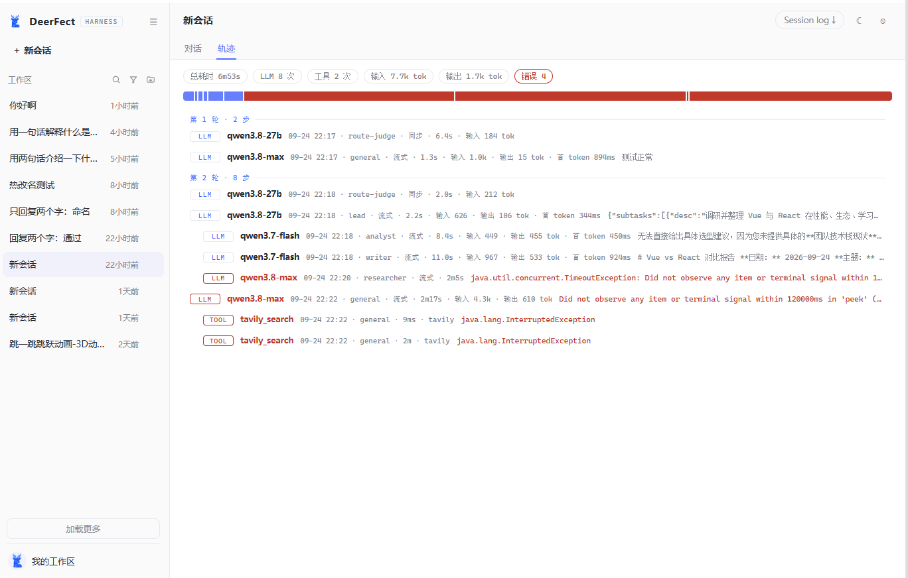

<div align="center">

[简体中文](README.md) | [English](README_EN.md)

</div>

<div align="center">


# Deerfect Harness

**让多个 AI 专家替你干活：任务发进来，自动拆解、并行执行、汇总交付。**

[](https://openjdk.org/projects/jdk/17/)
[](https://spring.io/projects/spring-boot)
[](https://spring.io/projects/spring-ai)
[](./LICENSE)
[](#-运行测试)

*简单问题直接答 · 复杂任务多 Agent 编排 · 全程流式可视化*

</div>

## 为什么需要它？

- 直接调对话 API：复杂任务要自己写循环编排、人工多轮搬运中间结果
- 通用编排框架（LangChain 等）：从零画图写代码，沙箱隔离、会话记忆、知识库还得自己拼
- 本项目把这些都做成开箱即用：**数据库里配两行就能跑**，拆解 → 专家并行 → 汇总全自动，连"模型失控""烧 token""子任务失败连坐"这些坑都提前铺好了护栏

## 核心亮点

### 🧠 智能分流与多 Agent 编排

- **LLM 路由判定**：简单问题直答不浪费 token，复杂任务才进编排——判定过程本身也可视化（「路由判定中…」→「判定完成：COMPLEX」）
- **Lead 拆解**：复杂目标拆成结构化任务书（目标 / 背景 / 约束 / 交付物四要素），子任务并发执行，聚合节点汇成成稿
- **专家团开箱即用**：researcher / coder / analyst / writer 四类通用专家 + 领域专员（如 WMS 仓储专员，10 个只读中文语义工具）；agent 表里加一行就是新专家，改库即生效
- **失败不连坐**：单个子任务失败写占位跳过，聚合照常进行——一个专家翻车不拖垮整张图

### 👁 全程流式可视化

- **真·逐 token SSE**：回答边生成边上屏，编排各阶段实时进度行
- **思考内容透传**：模型的思考 delta 实时折叠展示，lead / 子任务 / 聚合按身份归组——"谁在想什么"一目了然
- **工具行归属**：每次工具调用的参数摘要与耗时挂在发起它的子 agent 名下，多子任务交错流式也不乱
- **四张观测表**：LLM 调用（耗时 / token / 重试轮次）、工具调用、RAG 检索、MCP 连接事件全部落库，Web 轨迹页可查

### 🛡 预算护栏与自愈

- **上下文预算体系**：lead 拆解 / 聚合 / 工具结果注入分段裁剪，输出按角色分档封顶——长任务不炸上下文、不烧爆 token
- **工具硬上限**：单次调用工具次数与结果注入总量双重钳制，防模型循环空转
- **子任务双闸**：数量上限（默认 4）+ 墙钟超时（默认 10 分钟），到点写占位跳过
- **断连自愈**：流空闲看门狗 + 死连接丢池重建 + 逐通道重试（路由判定 / 编排子任务 / 直答全覆盖），空闲后第一发不再黑洞挂死
- **断点续跑**：长编排中断后从检查点继续，已完成的子任务不重跑

### 📚 知识与记忆

- **混合检索 RAG**：pgvector 向量召回 + BM25 关键词召回，双路 RRF 融合排序，回答自动附知识出处
- **会话记忆**：多轮上下文自动组装与预算裁剪
- **用户画像**：离线批量提炼跨会话偏好，注入直答与编排，越聊越懂你

### 🔌 开放接入与安全

- **MCP 工具生态**：多 server 配置（stdio / HTTP）、按 server 懒连接与故障隔离，兼容 Claude/Cursor 的 `mcp-config.json`
- **三种入口**：REST API（同步 / 流式）、Claude Code 风格终端 CLI、QQ 机器人（NapCat）
- **Docker 沙箱**：模型生成的代码只在容器里跑，宿主机零暴露
- **登录鉴权**：口令换 HttpOnly Cookie，机器客户端走 `X-API-Token`，连续失败限流锁定
- **独立领域适配范例**：[wms-mcp-adapter](./wms-mcp-adapter) 把已有 WMS 系统包装成只读 MCP server——最小权限、审计字段黑名单、分页钳制

## 快速开始

**1️⃣ 准备**：JDK 17+、Maven 3.8+、MySQL 8.x，建一次库（表结构启动时自动创建）：

```sql
CREATE DATABASE IF NOT EXISTS harness DEFAULT CHARACTER SET utf8mb4;
```

**2️⃣ 打包并启动主服务**：

```bash
mvn -DskipTests package
java -jar server/target/javaHarness-server-0.0.1-SNAPSHOT.jar
```

**3️⃣ 开始对话**——三选一：

```bash
# Web 控制台（推荐：会话管理 / 思考折叠 / 轨迹观测全都有）
cd web && npm install && npm run dev   # 打开 http://localhost:5173
```

```bash
# 终端 CLI
mvn -pl cli -Pcli compile exec:exec
```

```bash
# 直接 curl
curl -s -X POST http://localhost:8080/api/chat \
  -H "Content-Type: application/json" \
  -d '{"message":"你好"}'
```

> [!TIP]
> - 没配 API Key 也能启动（调用模型才报 401）；配 DashScope / DeepSeek 等服务商的 Key 见 **[`docs/guides/setup.md`](./docs/guides/setup.md)**
> - 启动时设置环境变量 `APP_PASSWORD=你的口令` 即开启登录鉴权（不设置则跳过登录）
> - 不想装环境？Docker 三件套一键起：**[`docs/guides/docker-deploy.md`](./docs/guides/docker-deploy.md)**
> - 国内网络可追加 `-s .mvn/settings.xml` 走阿里云镜像（会改用项目内 `.mvn-repo/` 仓库，首次全量重新下载）

## 效果展示

**首页 · 会话与对话（会话列表 / 流式回答 / 卡片式输入区）**



**轨迹视图 · 调用链可观测（route-judge 与直答两段 LLM 调用、耗时与 token 记账）**



## 📖 文档

| 文档 | 内容 |
|---|---|
| **入门** | |
| [`docs/guides/setup.md`](./docs/guides/setup.md) | 本地部署详解（数据库 / API Key / 启动脚本 / agent 服务商核对） |
| [`docs/guides/docker-deploy.md`](./docs/guides/docker-deploy.md) | Docker 三件套部署（构建 / ACR 拉取 / 离线部署） |
| [`docs/guides/models.md`](./docs/guides/models.md) | 多模型与多服务商接入 |
| [`docs/guides/first-run-audit.md`](./docs/guides/first-run-audit.md) | 首次使用流程规则与走查记录 |
| **架构** | |
| [`docs/architecture.md`](./docs/architecture.md) | 架构总览与数据流 |
| [`docs/project-structure.md`](./docs/project-structure.md) | 服务端目录树（[EN](./docs/project-structure_EN.md)） |
| [`docs/data-flow.md`](./docs/data-flow.md) | 数据流详解 |
| [`docs/TECH_STACK.md`](./docs/TECH_STACK.md) | 技术栈明细与扩展方向 |
| **功能指南** | |
| [`docs/guides/api.md`](./docs/guides/api.md) | REST 接口全表与知识库管理页 |
| [`docs/guides/cli.md`](./docs/guides/cli.md) | CLI 命令 |
| [`docs/guides/knowledge-rag.md`](./docs/guides/knowledge-rag.md) | RAG 知识库配置（[EN](./docs/guides/knowledge-rag_EN.md)） |
| [`docs/guides/mcp-tools.md`](./docs/guides/mcp-tools.md) | MCP 工具接入 |
| [`docs/guides/wms-mcp.md`](./docs/guides/wms-mcp.md) | WMS 仓储查询 MCP 适配（独立 adapter、只读工具集） |
| [`docs/guides/qq-channel.md`](./docs/guides/qq-channel.md) | QQ 机器人接入 |
| [`docs/guides/resume.md`](./docs/guides/resume.md) | 断点续跑 |
| **协议与规范** | |
| [`docs/guides/sse-protocol.md`](./docs/guides/sse-protocol.md) | SSE 流式协议（[EN](./docs/guides/sse-protocol_EN.md)） |
| [`docs/guides/commit-convention.md`](./docs/guides/commit-convention.md) | 提交规范（Conventional Commits） |
| [`docs/guides/context-optimization.md`](./docs/guides/context-optimization.md) | 上下文优化与 Token 预算策略 |
| **测试与演进** | |
| [`docs/guides/functional-testing.md`](./docs/guides/functional-testing.md) | 测试全景 |
| [`docs/HARNESS_TODO.md`](./docs/HARNESS_TODO.md) | 落地 TODO / 路线图 |

> 完整文档索引与存档目录（设计文档 design/、报告 reports/、历史计划 superpowers/）见 **[`docs/README.md`](./docs/README.md)**。

## 技术架构

Maven 多模块：`shared`（领域模型与 SSE 协议）+ `server`（Spring Boot 主服务）+ `cli`（终端客户端）+ `web`（Vue3 自包含前端）+ `wms-mcp-adapter`（领域 MCP 适配范例）。核心链路：`ChatController` 入口 → `RouteJudge` 判定 SIMPLE / COMPLEX → 路径 A 单 Agent 直答 或 路径 B StateGraph 编排（Lead → 专家并行 → Aggregator）→ 统一出口；QQ 渠道独立包隔离（`channel/qq`），只依赖 ChatService / SessionService 接口。

架构图与数据流细节见 **[`docs/architecture.md`](./docs/architecture.md)** 与 **[`docs/data-flow.md`](./docs/data-flow.md)**。

## 🧪 运行测试

单元测试基于 JUnit 5 + Mockito，**不依赖真实数据库 / 网络 / API Key**：

```bash
mvn test
```

> [!NOTE]
> `JavaHarnessApplicationTests` 是 `@SpringBootTest`，会尝试连接本机 MySQL；无数据库环境下单独运行该类可能因连接失败报错（其余业务测试不受影响）。测试全景见 [`docs/guides/functional-testing.md`](./docs/guides/functional-testing.md)。

## 🤝 贡献

欢迎提 Issue 与 PR：问题描述请带复现步骤与日志；提交 PR 前请跑通 `mvn test`。

## 📄 许可证

[MIT](./LICENSE) © 2026 cxknotjj

## 🙏 参考与致谢

- 🦌 [Deer-Flow](https://github.com/bytedance/deer-flow)（字节跳动）— 多 Agent 编排范式与专家角色划分
- ⌨️ [Claude Code](https://github.com/anthropics/claude-code)（Anthropic）— CLI 终端交互设计
- 🐳 [DeepSeek](https://github.com/deepseek-ai) — Agent 工具库设计与最小权限思路

---

<div align="center">

**⭐ 如果这个项目对你有帮助，欢迎点个 Star！**

Made with ☕ and ❤️ by Deerfect Harness contributors

</div>
