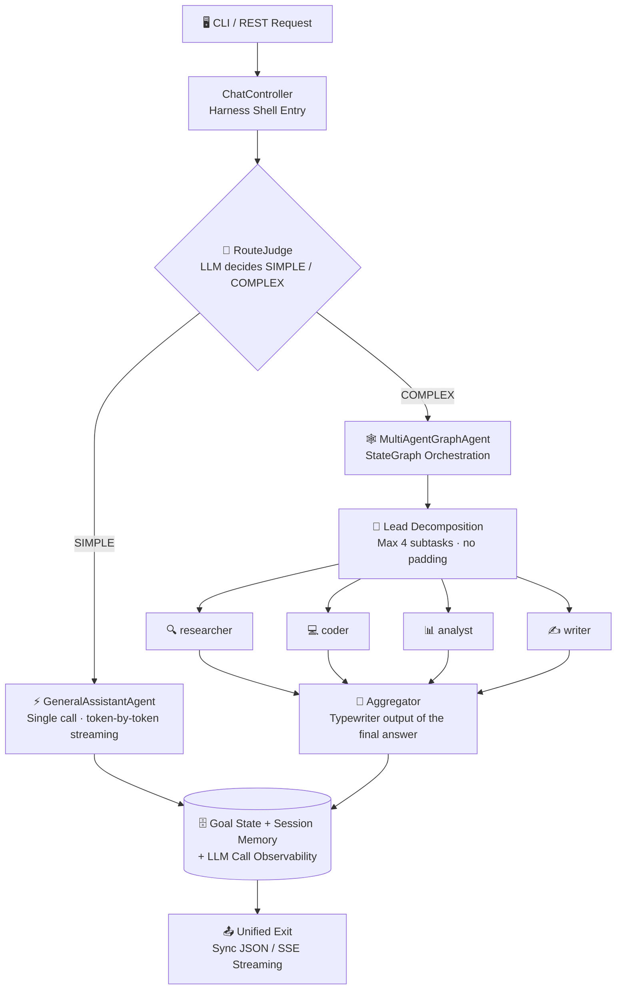
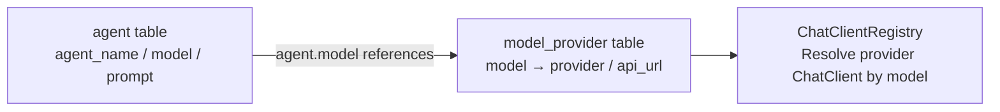

<div align="center">

[简体中文](README.md) | [English](README_EN.md)

</div>

<div align="center">


# Deerfect Harness

**An AI Agent orchestration framework built on Spring AI — a goal-driven, multi-agent execution harness**

[](https://openjdk.org/projects/jdk/17/)
[](https://spring.io/projects/spring-boot)
[](https://spring.io/projects/spring-ai)
[](https://github.com/alibaba/spring-ai-alibaba)
[](https://www.mysql.com/)
[](#-running-tests)
[](#-prerequisites)

*Simple questions answered directly · Complex tasks orchestrated across agents · Fully streaming, end to end*

</div>

---

## 📑 Table of Contents

- [✨ Feature Highlights](#-feature-highlights)
- [🏗️ Architecture Overview](#%EF%B8%8F-architecture-overview)
- [🧰 Tech Stack](#-tech-stack)
- [🚀 Quick Start](#-quick-start)
- [🐳 Docker Deployment](#-docker-deployment)
- [🎮 CLI Usage](#-cli-usage)
- [🌐 REST API](#-rest-api)
- [📡 SSE Streaming Protocol](#-sse-streaming-protocol)
- [🔁 Resume from Checkpoint](#-resume-from-checkpoint)
- [🤖 QQ Bot](#-qq-bot)
- [🔌 Multi-Model & Multi-Provider](#-multi-model--multi-provider)
- [🔌 MCP Tools](#-mcp-tools)
- [📁 Project Structure](#-project-structure)
- [🧪 Running Tests](#-running-tests)
- [🙏 References & Acknowledgements](#-references--acknowledgements)

## ✨ Feature Highlights

| | Feature | Description |
|---|---|---|
| 🧠 | **Smart Routing** | An upfront LLM judge decides SIMPLE / COMPLEX: small talk and Q&A get answered directly, only complex tasks enter orchestration — no wasted tokens |
| 🕸️ | **Multi-Agent Orchestration** | StateGraph "Lead decomposition → experts in parallel → aggregation"; subtasks are decomposed by difficulty (at most 4, no padding) |
| 👨‍👩‍👧‍👦 | **Expert System** | Four expert roles — researcher / coder / analyst / writer — configured from the database; lead assigns each subtask to the right expert |
| 📺 | **True Streaming** | Token-by-token SSE push with typewriter effect, plus real-time progress events for every orchestration stage (orchestration / decomposition / subtasks / aggregation) |
| 🧵 | **Thread-Pool Governance** | Background goals run in a managed bounded pool (capacity cap + fast-fail to FAILED when full); streaming dispatch uses a separate pool so the two never starve each other |
| 🛡️ | **Sandbox Isolation** | Model-generated code/commands run inside Docker containers with zero host exposure; tools are assigned per expert under least privilege |
| 💾 | **Session Memory** | Multi-turn context assembled automatically: filtering / token-budget truncation / role normalization |
| 🔁 | **Resume from Checkpoint** | graph-core checkpoints persisted to MySQL; after an interruption, `/resume` continues from the breakpoint without re-running completed nodes |
| 🧮 | **Call Observability** | Every LLM call is logged: latency / tokens / outcome, queryable per session |
| 🖥️ | **Claude Code-style CLI** | In-place spinner refresh, tool-call lines, turn summaries — a terminal experience modeled after Claude Code |

## 🏗️ Architecture Overview



> [!TIP]
> For data-flow details see [`docs/data-flow.md`](./docs/data-flow.md) (Chinese), for the roadmap see [`docs/HARNESS_TODO.md`](./docs/HARNESS_TODO.md) (Chinese), and for the full test landscape see [`docs/functional-testing.md`](./docs/functional-testing.md) (Chinese).

## 🧰 Tech Stack

| Layer | Technology | Description |
|---|---|---|
| 🏛️ Framework | Spring Boot 3.5.14 | Application skeleton, DI, REST, auto-configuration |
| 🤖 AI Access | Spring AI 1.1.4 + `spring-ai-starter-model-openai` | OpenAI-compatible access to multiple providers (DashScope / DeepSeek); `Registry` pattern routes by model |
| 🕸️ Graph Orchestration | `spring-ai-alibaba-graph-core` 1.1.2.2 | StateGraph multi-agent orchestration + lifecycle-hook progress events + checkpoint-based resumption |
| 📦 Sandbox | `spring-ai-alibaba-sandbox` 1.1.2.2 | Container-level tool execution isolation (agentscope-runtime): Python/Shell/file + browser; requires local Docker |
| 🔌 MCP | `spring-ai-starter-mcp-client` + `server-webmvc` (SDK pinned to 0.17.0) | Client connects to external tools across multiple servers (lazy + failure isolation); server exposes the `/mcp` endpoint over Streamable-HTTP |
| 📚 RAG | `spring-ai-pgvector-store` + PostgreSQL (pgvector) + DashScope text-embedding-v4 | Knowledge-base vector search: incremental ingestion + retrieval enhancement on both paths (optional dependency; an unavailable PostgreSQL never blocks startup) |
| 🗄️ ORM | MyBatis-Plus 3.5.7 | CRUD for `goal` / `session` / `session_messages` / `agent` / `model_provider` |
| 🛫 Schema | Flyway | Migrations run automatically at startup — no manual table creation |
| 🖥️ CLI | In-house `ChatCli` + OkHttp 4.12 | Standalone pure HTTP client process; SSE parsing + terminal rendering |
| ✅ Validation / JSON | Jakarta Validation / Jackson | Parameter validation, DTO serialization, SSE meta parsing |
| 🛠️ Build | Maven (in-project repo `.mvn-repo`) | See [Quick Start](#-quick-start) |

## 🚀 Quick Start

### 📋 Prerequisites

| Dependency | Required | Notes |
|---|---|---|
| ☕ JDK | ✅ | 17+ |
| 🛠️ Maven | ✅ | 3.8+ (in-project settings; no global configuration needed) |
| 🗄️ MySQL | ✅ | `harness` database; Flyway creates all tables at startup |
| 🐳 Docker Desktop | ⚠️ For sandbox | Container isolation for Python/Shell/browser tools; without Docker only sandbox-class tools are unavailable, everything else works (pre-pull images, see `docs/TECH_STACK.md`) |
| 🔑 API Key | 🔄 Optional | DashScope (Qwen) / DeepSeek; the app starts without keys — model calls return `invalid_api_key` |

### ⚡ One-Click Start

> [!TIP]
> Three launcher scripts — pick one (**never run two at once**, port 8080 would clash):
> - **`run-wsl.bat`** (recommended on Windows): double-click to enter WSL automatically — compile → start the service in the background (log at `/tmp/javaHarness-server.log`) → this window becomes the CLI once ready
> - **`run.sh`** (WSL terminal): `./run.sh` runs the full flow — compile → open a new window for the service → poll until ready in this terminal → enter the CLI; subcommands `server / stop / cli / build / test`
> - **`run-win.bat`** (native Windows): for a Windows-side checkout with Windows JDK/Maven

### 🔧 Manual Start

**1️⃣ Start the main service**

```powershell
mvn -s .mvn/settings.xml spring-boot:run
```

**2️⃣ In another terminal, start the CLI**

```powershell
mvn -s .mvn/settings.xml exec:java
```

**3️⃣ Or chat directly over REST (no CLI needed)**

```bash
curl -s -X POST http://localhost:8080/api/chat \
  -H "Content-Type: application/json" \
  -d '{"message":"你好"}'
```

**4️⃣ (Optional) Configure real API keys**

Any one of the following, then restart the service (the app also starts with no keys — model calls fail with a 401 placeholder-key error):

```powershell
# Option 1: system-level environment variables (recommended; global for new windows; WSL sessions need WSLENV passthrough)
setx QWEN_API_KEY "sk-your-key"      # DashScope (Qwen)
setx DEEPSEEK_API_KEY "sk-your-key"  # DeepSeek
setx WSLENV "QWEN_API_KEY/u:DEEPSEEK_API_KEY/u"   # pass into WSL (needed when running Linux-side)

# Option 2: repo-root .env.local (auto-sourced by run.sh / run-wsl.bat; gitignored)
#   QWEN_API_KEY=sk-your-key
#   DEEPSEEK_API_KEY=sk-your-key

# Option 3: current terminal session only
$env:QWEN_API_KEY = "sk-your-key"    # Windows PowerShell; use export QWEN_API_KEY=... in WSL
```

## 🐳 Docker Deployment

No JDK/Maven/database on the box? The `docker/` directory brings up a trio in one go: **app + MySQL 8.4 (primary) + pgvector (RAG knowledge base)**, with all configuration injected via environment variables — zero changes to `application.yaml`; primary-schema creation is self-contained via in-image Flyway. Images can be obtained by **local build**, **Aliyun ACR pull (build-free)** or **offline tar import**.

> [!TIP]
> Full walkthrough (build / `.env` / knowledge init / ACR pull / offline deploy): **[`docs/docker-deploy.md`](./docs/docker-deploy.md)** (Chinese).

## 🎮 CLI Usage

The CLI is a pure HTTP client (**listens on no port**) and talks to the main service over REST:

```text
你> 你是谁
千问> 我是通义千问，一个AI助手...
```

| Command | Effect |
|---|---|
| Type any text | Chat with the current agent (general by default); multi-turn memory carries over |
| `/new [name]` | 🆕 Create a session and switch to it (the old one is kept) |
| `/agent <id>` | 🎭 Switch to an agent (primary key of the `agent` table); `/agent` shows current; `/agent off` restores smart routing |
| `/resume <goalId>` | 🔁 Resume an interrupted orchestration from its checkpoint (goalId appears in the session info at the end of each turn) |
| `/help` / `/exit` | ❓ Help / 🚪 Exit |

## 🌐 REST API

| Method | Path | Description |
|---|---|---|
| `POST` | `/api/chat` | 💬 Sync chat: `{"message":"你好","agentId":1}` |
| `POST` | `/api/chat/stream` | 📺 Streaming chat (SSE): same request body, token-by-token push |
| `POST` | `/api/chat/resume?goalId=` | 🔁 Resume an interrupted orchestration; response format identical to `/stream` |
| `GET` | `/api/harness/agents` | 🧩 Registered agents |
| `GET` | `/api/harness/goals` | 🎯 Goals (with chat records) and statuses |
| `GET` | `/api/harness/goals/{id}` | 🎯 Query a single goal's status |
| `POST` | `/api/harness/submit?agent=general&objective=...` | 📤 Submit an async goal |
| `POST` | `/api/harness/sessions` | 🆕 Create a session (optional `name`), returns sessionId/name |
| `GET` | `/api/llm-calls?sessionId=&limit=` | 🧮 LLM call observability: latency / tokens / outcome (default 50) |
| `POST` | `/api/knowledge/sync` | 📚 Incremental ingestion: scan `knowledge/`, re-embed mtime-changed docs, and purge orphan vectors of deleted files |
| `GET` | `/api/knowledge/documents?page=&size=` | 📚 Paged ingestion ledger |
| `GET` | `/api/knowledge/search?q=` | 📚 Debug retrieval: hit chunks & scores (not injected into prompts) |
| `DELETE` | `/api/knowledge/documents/{name}` | 📚 Delete a knowledge document (vector chunks + ledger) |

> [!NOTE]
> `agentId` is optional (primary key of the `agent` table): when absent, the default agent (general) handles the request.
>
> Knowledge endpoints require `app.knowledge.enabled=true` (default) plus pgvector / embedding config; they return 503 when disabled.

### 📚 Knowledge Base QA (RAG)

Drop documents into the `knowledge/` directory (`.md` / `.txt`, optional front-matter `title:`); after ingestion both paths automatically retrieve & inject before answering, with inline `【Source N】` citations and a source footnote. Retrieval runs as a side check before prompt assembly — if any of the five gating conditions fails it silently degrades with zero impact on the main path.

> [!TIP]
> Multi-KB & agent binding, directory watching / BM25 hybrid retrieval and other enhanced settings: **[`docs/knowledge-rag_EN.md`](./docs/knowledge-rag_EN.md)**; decision flow & sequence diagram: [`docs/data-flow.md` section 5i](./docs/data-flow.md#5i-rag-知识检索注入数据流prompt-组装前旁路).

## 📡 SSE Streaming Protocol

Streaming responses use an SSE-style line protocol (one element per line, `event:` + `data:` pairs): `token` for incremental text, `progress` for orchestration stages (not stored in session memory), `meta` for end-of-turn session info & knowledge sources, `error` for in-stream errors — terminated by `[DONE]`.

> [!TIP]
> Full event stream example & field reference: **[`docs/sse-protocol_EN.md`](./docs/sse-protocol_EN.md)**; resume responses share the same format as `/stream`.

## 🔁 Resume from Checkpoint

Complex orchestration (the COMPLEX path) is built on the graph-core checkpoint system (`MysqlSaver` creates and persists tables automatically, `threadId=goalId`):

| Interruption Point | Resume Behavior |
|---|---|
| ✅ Orchestration already finished | Zero LLM calls; the final answer is replayed directly |
| ⏸️ Subtask batch done, aggregation interrupted | Only aggregation re-runs (typewriter output); subtask results are reused |
| ⏹️ Earlier (e.g. mid subtask batch) | Completed nodes are not re-run; only the gap is executed |
| 🚫 No checkpoint at all | Fast fail: reports that the goal never went through the complex path |

```bash
# Via API
curl -N -X POST "http://localhost:8080/api/chat/resume?goalId=<goalId>"

# Via CLI
/resume <goalId>
```

> [!NOTE]
> Missing `goal` returns 400; still running returns 409; with no checkpoint an `error` event is emitted in-stream.

## 🤖 QQ Bot

A third entry point besides CLI / REST: connects to QQ group & private chats via [NapCat](https://napneko.github.io/) over the **OneBot 11 protocol (HTTP POST mode)**. Incoming messages go through the same pipeline as REST (session memory → SIMPLE/COMPLEX routing → orchestration), and replies are sent progressively like a real person.

| Capability | Notes |
|---|---|
| 💬 Group wake-up | `at` / `prefix` / `all` trigger modes; private chats answer directly |
| 🚦 Anti-flooding | Per-user rate limit + private-chat whitelist (empty = unrestricted) |
| 🎯 Pinned Agent | Bound sessions still go through unified routing; failed orchestrations fall back to that Agent |

> [!TIP]
> Setup steps (NapCat dual-channel config), progressive sending / emoji / humanized delays and all parameters: **[`docs/qq-channel.md`](./docs/qq-channel.md)** (Chinese); disable via `napcat.enabled: false` in `application.yaml`.

## 🔌 Multi-Model & Multi-Provider

**Database-driven multi-agent + multi-provider** — adding providers takes zero code:



- 🧩 **Agents** (`agent` table): one row per agent (`agent_name`/`model`/`prompt`). Seed rows: `general`/`deepseek` (chat), `multi-agent` (orchestrator), `lead` (decomposer), `aggregator`, and the experts `researcher`/`coder`/`analyst`/`writer`
- 🗺️ **Model mapping** (`model_provider` table): adding a model/provider = adding one row (`status=1`) and restarting; `status=0` disables it → falls back to the default DashScope client
- 🧭 **Routing**: a request carrying `agentId` maps to `agentName` for routing; misses fall back to the default `general`

> [!TIP]
> **Add a third-party provider (e.g. Moonshot, OpenRouter) with zero code**:
> 1. Set the environment variable `MOONSHOT_API_KEY` (convention: `<PROVIDER in upper case>_API_KEY`)
> 2. Add a row to `model_provider`: `INSERT INTO model_provider(model, provider, api_url, status) VALUES('kimi-k2','moonshot','https://api.moonshot.cn/v1',1);`
> 3. Restart to take effect
>
> Alternatively, map keys explicitly in `application.yaml` under `app.providers.<provider>.api-key` (takes priority over the environment-variable convention; existing variable names stay compatible).

> [!WARNING]
> For security, API keys are never stored in the database. Resolution rules (convention over configuration):
> 1. `app.providers.<provider>.api-key` (explicit yaml mapping, highest priority)
> 2. `<PROVIDER in upper case>_API_KEY` environment variable (fallback by convention, e.g. `QWEN_API_KEY`, `DEEPSEEK_API_KEY`)
>
> Key **loading channels**: system-level environment variables (Windows side + `WSLENV` passthrough into WSL) > repo-root `.env.local` (auto-sourced by the launch scripts, gitignored) > current-session `export`; resolution priority is unaffected by the channel.

## 🔌 MCP Tools

The tool ecosystem is extended via MCP: the client supports stdio (local processes) and Streamable HTTP (remote servers) with lazy connection and per-server failure isolation. Connection config lives in the project-root `mcp-config.json` (Claude/Cursor-style `mcpServers` structure); **it contains API keys and is not committed** (gitignored, create your own after cloning).

> [!TIP]
> Config template, per-agent tool assignment and `general` least-privilege alignment: **[`docs/mcp-tools.md`](./docs/mcp-tools.md)** (Chinese).

## 📁 Project Structure

A multi-module Maven project: `shared` (domain model & SSE protocol) + `server` (Spring Boot main service) + `cli` (command-line client) + `web` (self-contained Vue3 frontend); the server follows the classic layered architecture (Controller → Service → Mapper/Entity) with domain models grouped under the `domain` parent package.

> [!TIP]
> Full server-side directory tree with per-file notes: **[`docs/project-structure_EN.md`](./docs/project-structure_EN.md)**.

## 🧪 Running Tests

Unit tests run on JUnit 5 + Mockito and need **no real database / network / API keys** (currently 327 test cases, all green):

```bash
mvn -s .mvn/settings.xml test
```

<details>
<summary><b>🔍 Click to expand the test coverage list</b></summary>

| Group | Tests | What it verifies |
|---|---|---|
| 🧭 Routing & sessions | `LlmRouteJudgeTest` `AgentServiceImplTest` `AgentConfigProviderTest` `SessionServiceImplTest` `GoalServiceImplTest` | SIMPLE/COMPLEX routing and malformed-JSON fallback, multi-agent routing with fallback, session & goal lifecycle |
| 🤖 Agent calls | `AgentChatCallerTest` `AgentChatCallerRetryTest` `LlmRetryTest` `GeneralAssistantAgentTest` | Tool loop with budget accounting & circuit breaking, hallucinated-tool fallback retry, retry policy, progressive token emission (anti fake-streaming regression) |
| 🕸️ Orchestration | `MultiAgentGraphAgentTest` `ProgressLineTest` | Orchestration closed loop, progress ordering (anti deadlock / lost events), expert dispatch whitelist, checkpoint resume (gaps filled / completed nodes reused), **partial budget degradation** (remaining subtasks skipped, aggregation keeps earlier results) |
| 🧩 Prompt assembly | `PromptAssemblerTest` `MemoryPolicyTest` `SkillManagerTest` `SkillRepositoryTest` `ToolLazyManagerTest` | Five-section assembly, per-role memory injection matrix, dynamic skill assembly, two-phase lazy tool-schema loading |
| 🎚️ Budget & observability | `ContextBudgetPropertiesTest` `ContextAssemblingAdvisorTest` `PromptBudgetAdvisorTest` `ToolCallBudgetTest` `ToolCallTracerTest` `LlmCallRecorderTest` | yaml binding with 0=unlimited semantics, context/section trimming, tool count & result budget, start-stop progress lines, call observability persistence |
| 🔌 Tools & MCP | `WebToolsTest` `SandboxToolProviderTest` `McpToolProviderTest` `ToolAssignmentsTest` | HTML→Markdown extraction and protocol whitelist, sandbox lazy-init degradation, MCP multi-server config parsing, least-privilege tool assignment with dedup |
| 📚 Knowledge base (RAG) | `MarkdownChunkerTest` `KnowledgeDocumentScannerTest` `KnowledgeServiceImplTest` `KnowledgeRetrieverTest` | Paragraph-aware chunking with overlap carryover, front-matter parsing & bad-file skip, incremental ingestion / delete / pagination / search (mocked VectorStore+Mapper), role skip / budget truncation / 【Source N】 rendering |
| 🖥️ CLI | `TerminalRendererTest` `TerminalInputTest` `ResumeStateStoreTest` | Markdown line coloring and incremental streaming output (anti ghost-repeat regression), degraded input without a TTY, resume-state read/write roundtrip |
| 🌐 API & infrastructure | `ChatControllerTest` `HarnessControllerTest` `ChatServiceImplTest` `GlobalExceptionHandlerTest` `ChatClientRegistryTest` `ChatClientFactoryTest` `ThinkingSwitchChatModelTest` `ProviderAdminServiceImplTest` `AgentRegistryTest` `ClientAbortLogFilterTest` `ModelQuotaExceptionTest` | REST contracts (streaming element-by-element / newlines), SSE contract & resume validation (400/409), uniform {code, message} errors, multi-provider registry with hot refresh, thinking switch |

</details>

> [!WARNING]
> `JavaHarnessApplicationTests` is a `@SpringBootTest` that tries to connect to local MySQL; running it standalone without a database may fail on connection (all other business tests are unaffected).

## 🙏 References & Acknowledgements

This project's design was inspired by the following excellent open-source projects/products — with thanks:

| Reference | What we borrowed |
|---|---|
| 🦌 [Deer-Flow](https://github.com/bytedance/deer-flow) (ByteDance) | The multi-agent orchestration paradigm — "Coordinator → Planner decomposition → experts in parallel → Reporter aggregation" and the researcher / coder / analyst / writer expert roles directly inspired this project's StateGraph orchestration and expert agent system |
| ⌨️ [Claude Code](https://github.com/anthropics/claude-code) (Anthropic) | The CLI terminal experience: in-place spinner refresh + collapsed completion archive, tool-call lines (`⏺ tool(args)` → `✓ duration`), diff `+green/-red` coloring, turn summaries and other interactions (`TerminalRenderer`) |
| 🐳 [DeepSeek](https://github.com/deepseek-ai) (deepseek-ai) | Agent toolset design: the capability split for web fetch (fetchUrl) and file/command tools, and the least-privilege idea of assigning tools per agent |

---

<div align="center">

**⭐ If this project helps you, please give it a Star!**

 Made with ☕ and ❤️ by Deerfect Harness contributors

</div>
