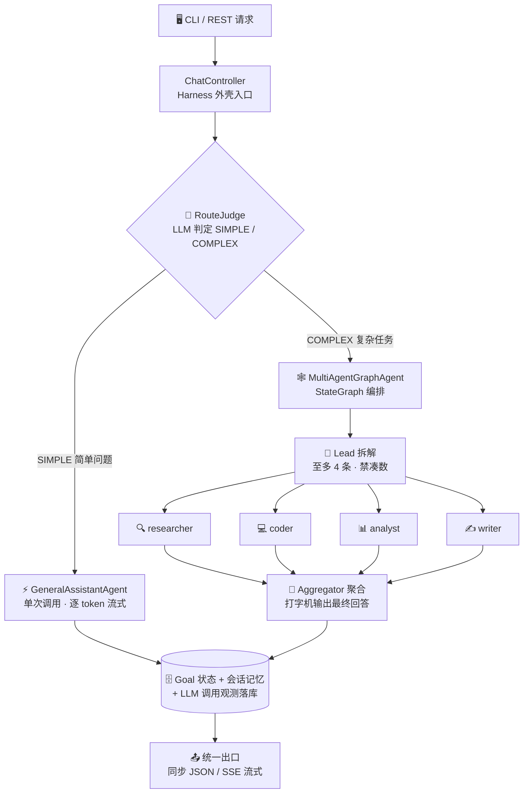

# 🏗️ 架构总览

> README 精简后迁入：整体架构图与相关文档入口。

---

> [!TIP]
> 数据流细节见 [`docs/data-flow.md`](data-flow.md)，落地 TODO 见 [`docs/HARNESS_TODO.md`](HARNESS_TODO.md)，测试全景见 [`docs/guides/functional-testing.md`](functional-testing.md)。

---

[⬅ 返回 README](../README.md)
