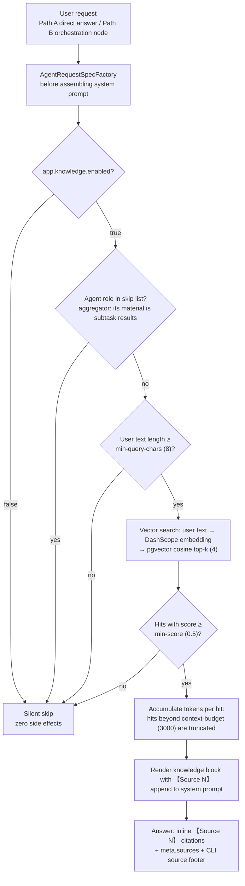
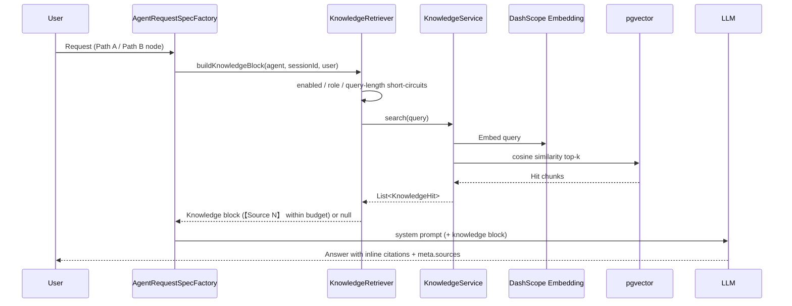

# 📚 Knowledge Base QA (RAG)

> Deep dive behind the README "REST API" section: gating conditions, multi-KB & agent binding, directory watching / BM25 hybrid retrieval.

---

Drop documents into the `knowledge/` directory (`.md` / `.txt`, optional front-matter `title:`); after ingestion both paths automatically retrieve & inject before answering:

```bash
mkdir -p knowledge && cp your-doc.md knowledge/
curl -X POST http://localhost:8080/api/knowledge/sync          # incremental ingestion (only mtime-changed docs re-embedded)
curl 'http://localhost:8080/api/knowledge/search?q=deploy'     # debug retrieval hit view
```

Answers carry `【Source N】` inline citations, the CLI prints a "Sources:" footer, and `meta.sources` / `ChatResponse.sources` expose structured provenance (doc name / title / score). Configuration (top-k / min score / injection budget) lives under `app.knowledge.*` in `application.yaml`.

#### 🗂️ Multiple Knowledge Bases & Agent Binding

Each first-level subdirectory of `knowledge/` is a standalone knowledge base (kb id); loose files at the root belong to the shared `default` base:

```bash
mkdir -p knowledge/java knowledge/frontend        # subdirectory = knowledge base
cp spring.md knowledge/java/ && cp vue.md knowledge/frontend/
curl -X POST http://localhost:8080/api/knowledge/sync
```

Set the `agent` table's `knowledge` column to a comma-separated list of kb ids (e.g. `java,frontend`) to bind an agent to specific bases — retrieval filters on the vector metadata `kb` field (`kb in [...]`), so an agent only reads its bound bases; leave it empty/NULL to search all knowledge. Moving a document across subdirectories (kb change) triggers automatic re-ingestion on the next sync.

#### 🔍 RAG Trigger Logic

RAG is never triggered by explicit commands — it is a **bypass check before every prompt assembly**; unmet conditions degrade silently with zero side effects on the main flow.

Trigger decision flow:



Retrieval injection sequence:



Trigger conditions (fully config-driven, tune via `application.yaml`):

| Trigger condition | Config key | Current value | When unmet |
|---|---|---|---|
| Knowledge base enabled | `enabled` | true | silent skip |
| Role not in skip list | — (aggregator skipped by policy) | aggregator | silent skip |
| Query length threshold | `min-query-chars` | 8 | silent skip |
| Hit score threshold | `min-score` | 0.5 | drop the hit |
| Within injection budget | `context-budget` | 3000 | truncate budget-exceeding hits |


---

[⬅ Back to README](../../README.md)
