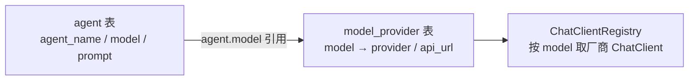

# 🔌 多模型与多服务商

> 数据库驱动的多 Agent / 多模型：表结构、路由与零代码新增供应商、API Key 解析规则。

---

**数据库驱动的多 Agent + 多模型服务商**，接入手性零代码：

- 🧩 **Agent**（`agent` 表）：每行一个 Agent（`agent_name`/`model`/`prompt`）。种子行：`general`/`deepseek`（聊天）、`multi-agent`（编排器）、`lead`（拆解器）、`aggregator`（聚合器）、`researcher`/`coder`/`analyst`/`writer`（专家）
- 🗺️ **模型映射**（`model_provider` 表）：新增模型/服务商 = 加一行（`status=1`）重启即生效；`status=0` 禁用 → 回退默认 DashScope 客户端
- 🧭 **路由**：请求携带 `agentId` → 映射 `agentName` 路由；未命中回退默认 `general`

> [!TIP]
> **新增第三方供应商（如 Moonshot、OpenRouter）零代码**：
> 1. 设置环境变量 `MOONSHOT_API_KEY`（约定规则：`<PROVIDER大写>_API_KEY`）
> 2. `model_provider` 表加行：`INSERT INTO model_provider(model, provider, api_url, status) VALUES('kimi-k2','moonshot','https://api.moonshot.cn/v1',1);`
> 3. 重启生效
>
> 也可在 `application.yaml` 的 `app.providers.<provider>.api-key` 显式映射（优先级高于环境变量约定），现有环境变量名保持兼容。

> [!WARNING]
> API Key 出于安全不落库，解析规则（约定优于配置）：
> 1. `app.providers.<provider>.api-key`（yaml 显式映射，优先）
> 2. `<PROVIDER大写>_API_KEY` 环境变量（约定式回退，如 `QWEN_API_KEY`、`DEEPSEEK_API_KEY`）
>
> Key 的**装载通道**：系统级环境变量（Windows 侧 + `WSLENV` 透传进 WSL）> 仓库根 `.env.local`（启动脚本自动 source，gitignored）> 当前会话 `export`；解析优先级不受通道影响。

---

[⬅ 返回 README](../README.md)
