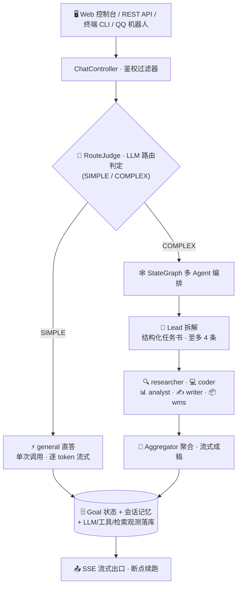

# 智算云上的多智能体编排平台
## ——Deerfect Harness 面向 LLM 工作负载的调度、部署与成本管理实践

---

## 一、项目概述

**Deerfect Harness** 是一个基于 Java 17 + Spring Boot 3.5 + Spring AI 1.1 构建的企业级 AI 智能体编排平台。任务发进来，自动拆解、并行执行、汇总交付：简单问题直答不浪费 token，复杂任务多 Agent 编排，全程流式可视化。

项目消费智算云上的模型推理服务（通义千问 DashScope、DeepSeek 等），在其之上构建了覆盖**算力调度、模型部署、智能体框架、AI 工作负载监控与成本管理**的完整应用层体系：

| 征集方向 | 项目对应能力 |
|---|---|
| 算力调度 | 请求级智能分流、模型分级路由、并发错峰、双闸资源保护、连接层自愈 |
| 模型部署 | 多服务商统一接入、模型配置库表化热生效、独立 MCP 服务、容器化交付 |
| 智能体框架 | 两路径编排、Lead 拆解-专家并行-聚合、RAG 混合检索、MCP 工具生态、Docker 沙箱 |
| 监控与成本管理 | 四张观测表、按轮次的 token 成本账本、四级预算护栏、观测数据保留期治理 |

**技术基线**：Java 17 / Spring Boot 3.5.14 / Spring AI 1.1.4 / spring-ai-alibaba-graph-core（StateGraph 编排）与 sandbox（容器沙箱）/ MySQL 9.x（主库）+ PostgreSQL pgvector（向量库）/ MyBatis-Plus / Vue 3 Web 控制台。服务端 700 个自动化测试用例，不依赖真实 DB 与外网。

---

## 二、总体架构

- **路径 A（SIMPLE）**：单 Agent 直答，逐 token 真·流式输出；
- **路径 B（COMPLEX）**：Lead 将复杂目标拆解为带「目标 / 背景 / 约束 / 交付物」四要素的结构化任务书，子任务并发执行，聚合节点汇成最终回答；
- **专属 Agent 直答**：会话绑定领域专员（如 WMS 仓储专员）时跳过判定与 RAG 预取，该 Agent 直接应答，避免编排链路额外开销。

---

## 三、算力调度：面向 LLM 推理负载的细粒度调度

项目的「算力」即云端模型推理资源（token 与并发），调度体系分五层：

### 3.1 请求级智能分流

`LlmRouteJudge` 以独立轻量 LLM 调用（独立连接池、10 秒读超时、无工具）判定请求复杂度：**简单问题直答不进编排**，避免为小任务支付 lead 拆解 + 多专家 + 聚合的成倍推理成本；判定异常兜底 SIMPLE（宁可简单，不烧 token）。判定过程本身可视化（「路由判定中…」→「判定完成：COMPLEX」）。

### 3.2 模型分级路由

`model_provider` 表登记各服务商模型端点，`agent` 表为每个智能体独立指定模型——**重活用强模型、轻活用快模型**：

- 路由判定 / 画像提炼等内部调用：`qwen3.8-27b`（轻量、短读超时）；
- 常规直答：`qwen3.7-flash`（默认）；
- 编排子任务与聚合：按专家分档配置 `qwen3.8-max` / `deepseek-v4-pro` 等；
- 嵌入服务：`text-embedding-v4`（1024 维）。

改库即生效，无需重启，相当于应用层的「按负载选卡」。

### 3.3 并发调度与错峰

子任务并行扇出经**信号量排队**（`subtask-concurrency: 2`）错峰执行：收敛下游智算服务的并发压力，并把预算熔断后的在途超额窗口从「整批」收窄到「至多 N 个在途调用」。流式 SSE 连接数设全局上限（默认 50，超限 429），防过载。

### 3.4 资源保护双闸

- **数量闸**：Lead 拆解子任务上限（默认 4，clamp [1,4]），防拆解滚雪球；
- **时间闸**：子任务墙钟超时（默认 600 秒），deadline 包装取消令牌，超时在 token 边界中止在途调用、写占位结果，聚合照常执行；
- **失败不连坐**：单个子任务失败写占位跳过，聚合 prompt 前置「失败说明」，一个专家翻车不拖垮整张图。

### 3.5 连接层算力利用率优化

针对云端推理服务长连接的「空闲后首调黑洞」问题（NAT / 网关静默杀闲置连接）：

- `ChatClientFactory` 强制 **HTTP/1.1**，利用 JDK 内建 30 秒空闲连接驱逐；
- **流空闲看门狗**（120 秒 `Flux.timeout`）+ **首帧超时**（20 秒，零帧请求快速判死）组合，闭合「完全静默挂死」与「慢速滴流」两种模式；
- 死连接丢池重建 + 逐通道重试（可重试口径统一：超时 / 网络类 IO / 5xx / 429 / 408；已有部分 token 下发、取消、4xx 业务错误不重试），重试以 `Mono.delay` 非阻塞退避，且按 attempt 粒度落库观测。

---

## 四、模型部署：多模型多服务商的统一接入

### 4.1 OpenAI 兼容协议统一网关

以 Spring AI OpenAI 兼容模式统一对接多家智算服务商（DashScope 兼容端点、DeepSeek 等），API Key 全部经环境变量注入不落库，端点 URL 以 `model_provider` 表为准。新增供应商通常零配置——设置对应环境变量即可。

### 4.2 模型配置库表化、热生效

`agent` 表每行定义一个智能体的模型、提示词、工具包、知识库绑定、思考内容透传开关；`AgentConfigProvider` 每次调用读取最新配置。**在数据库里配两行就能跑起新专家**，改库即生效，无需重新部署——模型资产的运维成本降到 SQL 级。

### 4.3 独立领域服务部署范例：wms-mcp-adapter

独立 Maven 模块，把已存量运行的 WMS 仓储系统（jeecg-boot REST）包装成**只读 MCP Server**（Streamable HTTP `/mcp`，端口 8090）：

- 10 个中文语义查询工具（任务查询 / 库存 / 单据等）；
- 适配侧加固：分页钳制 ≤20、审计字段黑名单（createBy / createTime 等出参剔除）、鉴权头可配置；
- 与主服务同机的进程级隔离部署，是「存量业务系统 AI 服务化改造」的最小侵入范例。

### 4.4 容器化交付

Docker 三件套一键部署（主服务 / MySQL / PostgreSQL），支持镜像构建、仓库拉取与离线部署；模型生成的代码与浏览器操作全部在**沙箱容器**内执行（Python/Shell base 容器 + browser 容器，按组独立初始化、失败只降级本组），宿主机零暴露。

---

## 五、智能体框架：从编排到 RAG 应用的全链路

### 5.1 多 Agent 编排

- **Lead 拆解**：复杂目标拆成结构化任务书（四要素：目标 / 背景 / 约束 / 交付物），单条上限 2000 字符；
- **专家团开箱即用**：researcher / coder / analyst / writer 四类通用专家 + 领域专员（wms）；专家只能用固定模板 + Lead 指定的工具包，Lead 不能凭空创造新身份（白名单硬约束）；
- **聚合节点**：并行子任务结果汇成成稿，失败 / 超时 / 预算占位自动识别并注入降级说明；
- **断点续跑**：长编排中断后从检查点继续，已完成子任务不重跑。

### 5.2 RAG 知识库（混合检索）

- pgvector 向量召回 + BM25 关键词召回，**双路 RRF 融合重排**（关键词 / 编号类查询召回显著更好）；
- 文档增量摄取：mtime 比对 → 段落感知切分（~700 字符 + 重叠）→ 嵌入分批（≤8/请求）→ 确定性 chunk id 精确覆盖；
- 检索注入：top-k 4、相似度阈值 0.5、注入预算 3000 token，回答自动附【出处N】引用与 `meta.sources`；
- 多知识库隔离：一级子目录多 KB + agent 表 `knowledge` 列绑定，向量 metadata 过滤；
- 检索限时 10 秒，超时静默降级不阻断聊天；PostgreSQL 不可用时应用照常启动。

### 5.3 工具生态

- **MCP 多 Server**：兼容 Claude / Cursor 的 `mcp-config.json`，stdio / HTTP 双传输，按 server 懒连接与故障隔离，连接失败不拖垮启动；
- **Docker 沙箱工具**：Python / Shell 执行、文件读写检索、浏览器操作（导航 / 快照 / 点击 / 输入）容器内执行；
- **工具分配硬边界**：未分配给专家的工具对模型不可见（服务端控制，非提示词约束）；
- **两段式工具暴露**：请求级只注入工具名称 + 用途索引，模型经 `expand_tool` 元工具按需展开完整 Schema，压缩上下文占用；Markdown 技能库同理（`load_skill` 按需加载 + mtime 热重载）。

### 5.4 记忆体系

- **会话记忆**：多轮上下文自动组装、按预算裁剪（MySQL 双表）；
- **用户画像**：后台定时扫描空闲会话（≥30 分钟静默），LLM 提炼跨会话偏好合并进全局画像（原子写防丢失），注入直答与 Lead 编排，越聊越懂用户。

### 5.5 多端接入

Web 控制台（会话管理 / 思考折叠 / 轨迹观测）、REST API（同步 / SSE 流式）、Claude Code 风格终端 CLI、QQ 机器人（NapCat / OneBot 11，群聊 @ 触发、私聊白名单 + 限频、渐进式拟人回复）。

---

## 六、AI 工作负载的监控、调度与成本管理

### 6.1 全链路观测

四张观测表全部落库，Web 轨迹页可查，观测查询统一经 `ObserveQueryService` 收口：

| 观测表 | 记录内容 |
|---|---|
| `llm_call_log` | 每次 LLM 调用的会话、角色、模型、同步/流式、成败、真实 token、耗时、错误 |
| `tool_call_log` | 工具调用参数摘要与耗时，归属发起它的子 Agent |
| kb_retrievals | RAG 检索命中与得分 |
| MCP 连接事件 | 各 server 连接成败与降级记录 |

**按模型轮次精确拆账**：Spring AI 工具循环默认把「决策轮 + 汇总轮」合并成一行日志，本项目按 usage 帧边界拆分——每轮独立记录真实 prompt / completion token、轮次序号、起止时间，成本核算到轮次粒度。

### 6.2 四级预算护栏

全部数值仅存于 application.yaml，代码零硬编码：

| 层级 | 机制 | 默认值 |
|---|---|---|
| 输入侧 | 会话历史 / lead 拆解 / 聚合 / 工具结果注入 分段裁剪 | 4000 / 4000 / 12000 / 5000 token |
| 输出侧 | 按角色分档 maxTokens：lead / 最终回答 / 专家 | 4000 / 8000 / 4000 token |
| 编排全程 | 单次编排 token 消费熔断（内存账本，真实 usage 优先） | 60000 token |
| 工具侧 | 调用次数硬上限 + 结果注入总量双钳制 | 4 次 / 5000 token |

超限断流、写占位跳过、聚合注入降级说明——**长任务不炸上下文、不烧爆 token**。

### 6.3 观测数据治理

`llm_call_log` / `tool_call_log` 按保留期（默认 90 天）分批删除（单批 1000 行防长事务），每日凌晨 3 点低峰期自动清理。

### 6.4 可视化与可解释性

- 真·逐 token SSE 上屏，编排各阶段实时进度行；
- 思考内容透传：模型思考 delta 实时折叠展示，按「思考 · general」「思考N · 专家名」「思考 · 聚合」身份归组；
- 工具行归属：每次工具调用挂在发起它的子 Agent 名下，多子任务交错流式不乱。

---

## 七、工程质量

- 服务端 75 个测试类 / **700 个用例**（另有 CLI 3 类、wms-mcp-adapter 4 类），不依赖真实 DB 与外网；
- Flyway 版本化数据库迁移（26 个版本迭代），存量库 baseline 无缝接入；
- 全局统一异常响应、双通道 API 鉴权（HttpOnly Cookie 登录态 + `X-API-Token` 机器通道、常量时间比较防时序探测、连续失败限流锁定）。

---

## 八、总结与展望

Deerfect Harness 在智算云模型服务之上，交付了一套**可观测、可预算、可自愈**的智能体平台：

1. **算力调度**——把「用多少推理算力」变成显式决策：简单 / 复杂分流、模型分级、并发错峰、双闸保护，层层收敛无效 token 消耗；
2. **模型部署**——多服务商统一接入 + 配置库表化热生效，模型资产运维成本降到 SQL 级，并给出存量系统 AI 服务化（wms-mcp-adapter）的范式；
3. **智能体框架**——Lead 拆解 / 专家并行 / 聚合的编排闭环，叠加混合检索 RAG、MCP 工具生态与沙箱隔离，从对话到 RAG 应用一站式覆盖；
4. **成本管理**——轮次级 token 账本 + 四级预算护栏 + 保留期治理，让 AI 工作负载的花费可核算、可控制、可审计。

**后续方向**：MCP 失败缓存 TTL 重试、Micrometer 全链路 Tracing、Redis 热点缓存、更多模态接入。
