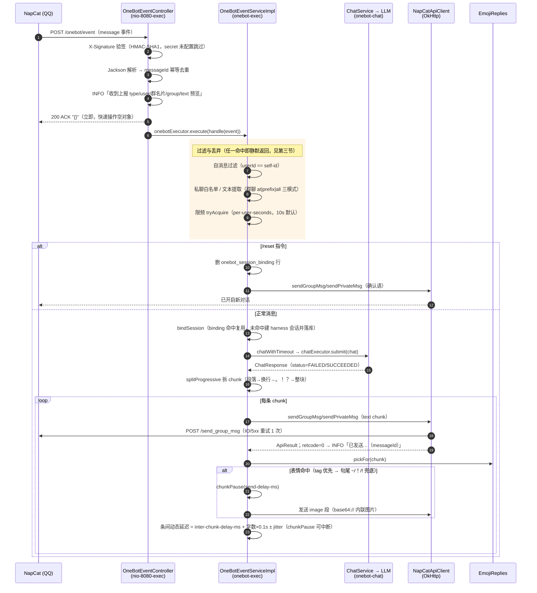

# channel 数据流与时序图

> QQ（NapCat / OneBot 11 纯 HTTP）通道专属数据流文档。主链路（API → ChatService → Agent → LLM）见 `docs/data-flow.md`，本文档只画 channel 侧：从 NapCat 上报到回复落地的完整时序、全部静默丢弃点、线程模型与发送细节。

## 一、线程模型（三条线程链）

| 线程链 | 归属 | 职责 | 语义 |
|---|---|---|---|
| `nio-8080-exec-*` | Tomcat | 接收上报、验签、解析、去重 | **立即 ACK**，不做任何慢事（NapCat 上报超时约 4~10s，同步处理会导致重发风暴） |
| `onebot-exec-*` | onebotExecutor（有界队列） | handle 全流程：过滤/提取/限频/建绑/调聊天/发回复 | 队列满 → log.error「异步池拒绝事件」 |
| `onebot-chat-*` | chatExecutor（8 线程） | 仅承载 `ChatService.chat` 阻塞调用 | 被 `chatWithTimeout` 120s（可配）看管；超时后 future.cancel(false)，任务继续跑完只落会话记忆 |

## 二、端到端时序图



## 三、静默丢弃点一览（「接到请求后没反应」排查表）

| # | 丢弃点 | 判定条件 | 日志 | 代码位置 |
|---|---|---|---|---|
| 1 | 上报验签失败 | X-Signature 校验不过（secret 已配置时） | **WARN**（403） | Controller.signatureValid |
| 2 | 重复上报 | messageId 已处理过 | DEBUG | Controller.onEvent |
| 3 | 异步池拒绝 | onebotExecutor 队列满 | **ERROR** | Controller.onEvent |
| 4 | 自消息过滤 | `user_id == napcat.self-id`（防自循环） | **无日志** | doHandle |
| 5 | 私聊白名单外 | `private-allow-users` 非空且不含该 uid | DEBUG | doHandle |
| 6 | 文本提取为空 | message 数组无 text 段且 raw_message 空 | **无日志** | doHandle |
| 7 | 群聊 @ 未命中 | mode=at 且 at 段 qq ≠ self-id（或 self-id 未配置） | **无日志** | extractGroupText → atSelf |
| 8 | 限频 | 同 uid 间隔 < per-user-seconds | DEBUG | doHandle |
| 9 | 聊天超时 | chatExecutor 超 chat-timeout-seconds（120s 默认） | **WARN**（放弃回复） | chatWithTimeout |
| 10 | 聊天执行异常 | LLM 链路抛异常 | **WARN** | chatWithTimeout |
| 11 | 未产出回复 | status≠SUCCEEDED 或 reply 空 | **WARN** | doHandle |
| 12 | 表情发送异常 | 表情钩子任何异常 | **WARN**（不影响文本） | sendReply |

> 4/6/7 三个点**完全无日志**——排查「收到上报但没调用大模型」时优先怀疑：群聊 @ 未命中（`napcat.self-id` 配置与实际 at 段 qq 是否一致）、文本提取为空。把 `logging.level.com.dark.javaHarness.channel.qq` 调到 DEBUG 可看到 2/5/8；临时排查可临时提升该包日志级别。

## 四、发送侧细节

### 拆分（progressive=true 时 splitProgressive，否则 splitReply 单条超长切）

层级切片，标点保留句尾，无字符硬切兜底：段落（\n\n）→ 换行（\n）→ 句读（。！？!?；;）→ 整块；`split-chars` 超限下沉下一层；`max-chunks` 防刷屏（超出部分合并进最后一条）。

### 条间动态拟人延迟

`延迟 = inter-chunk-delay-ms + chunk 字数 × delay-factor(0.1s/字) + ±jitter-range-ms 扰动`，再被 `max-delay-ms` 截断（0 = 不设上限）。首条不等待；按「即将发送的这条」取字数（模拟打完再发）。

### 表情钩子（每条 chunk 发送后，含最后一条）

1. `enabled=false` → 零行为
2. tag contains 优先（多命中随机取一）→ 无命中且句尾 `~`/`！`/`!` → cheer-emoji
3. probability 摇号（1.0 必发）→ sentEmojis < max-per-reply（0=不限）→ chunkPause(send-delay-ms) → 发 image 段

映射表：`channel/emoji-index.json`（表情名 → {path, tags}，启动加载一次，缺失/损坏空映射降级）；图片放 `channel/emojis/`（不进 git）。

## 五、持久化与外部交互

| 对象 | 类型 | 说明 |
|---|---|---|
| `onebot_session_binding` | MySQL 表 | session_key（private:uid / group:gid）→ harness session_id；仅 /reset 删除对应行（过期清理是 todo 缺口） |
| `/onebot/event` | HTTP POST 入站 | NapCat httpClients 推送；恒 200 ACK（防重发风暴） |
| `/send_group_msg` `/send_private_msg` `/get_login_info` | HTTP POST 出站 | OkHttp，3s 连接/10s 读超时；IO/5xx 重试 1 次；一切失败只记日志（尽力而为） |
| `channel/emoji-index.json` | 本地文件 | 表情映射表，启动加载一次（改后需重启） |

## 六、组件映射

```
channel/qq/
├── OneBotEventController     入站端点：验签/去重/ACK/异步分发
├── OneBotEventService(Impl)  编排：过滤→提取→限频→建绑→聊天→回复（含表情钩子）
├── NapCatApiClient(Impl)     出站客户端：发送 + 启动自检 + 成功/失败日志
├── EmojiReplies              表情匹配器：JSON 映射加载 + tag/句尾判定 + image 段生成
├── UserRateLimiter           同 uid 内存滑动窗限频
├── MessageDedupCache         messageId 幂等去重（内存）
├── NapCatChannelConfig       装配：napcat.enabled 条件装配 + onebotExecutor/chatExecutor
├── NapCatProperties          yaml 绑定（reply/emoji/rate-limit/group-trigger 等）
└── dto/                      OneBotEvent / MessageSegment / SendMsgRequest / ApiResult
```
